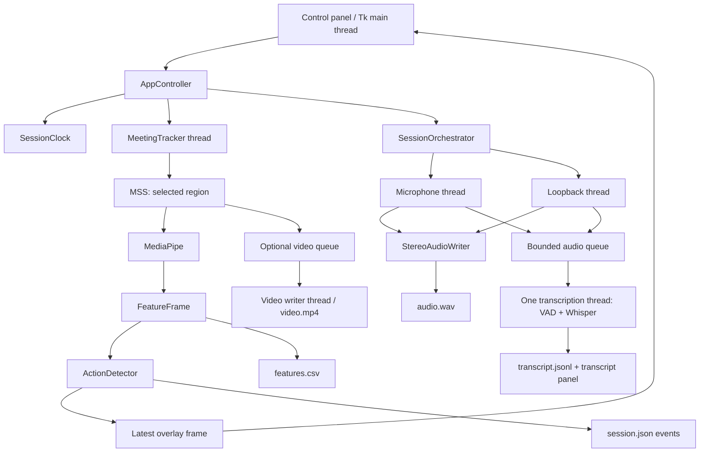

# Guide to Understanding and Evaluating the System

**Project:** AI-Assisted Real-Time Confusion Signal Detection and Teaching Support for Lecturers  
**Current application:** Multimodal Dataset Collector (`facial-cue-prototype`)  
**Code review baseline:** September 27, 2026  
**Fix and verification update:** September 29, 2026; see Section 13.  
**Purpose:** Help developers understand what the system does, why it does it, where its limits are, and what to improve next.

This describes the code version reviewed on the dates above. It is not a promise about future versions. Update this guide when the code changes. Documents in `docs/superpowers/` record design history and may differ from the current implementation.

> **Current checkout verification (September 29, 2026):** The current test run has four failing tests (two failures and two errors). See [testing.md](testing.md) for the results. Fix and test claims later in this guide describe the earlier review history and are not confirmed for this checkout.

## How to Read This Guide and Its Evidence Labels

- **[CODE]:** Confirmed by reading the current source code.
- **[MEASURED]:** Supported by a specific measurement; check its conditions before generalizing.
- **[INFERENCE]:** A technically grounded risk whose impact has not been measured in a real class.
- **[NEEDS TESTING]:** Insufficient data to judge correctness or accuracy.
- **[PROPOSAL]:** A possible improvement, not an existing feature.

Read Sections 1–4 for the architecture, 5–8 for the algorithms, 9–12 for data and performance, and 13–16 for improvement decisions. Markdown Preview in VS Code renders the tables and Mermaid diagram. The diagram is also explained in text.

## Contents

1. [What Is the System?](#1-what-is-the-system)
2. [Code Structure Map](#2-code-structure-map)
3. [Pipeline and Execution Threads](#3-pipeline-and-execution-threads)
4. [Session Lifecycle](#4-session-lifecycle)
5. [Images, Landmarks, and Features](#5-images-landmarks-and-features)
6. [Action Detection Algorithm](#6-action-detection-algorithm)
7. [Audio Pipeline](#7-audio-pipeline)
8. [Whisper, Pauses, and Transcripts](#8-whisper-pauses-and-transcripts)
9. [Timestamps and Synchronization](#9-timestamps-and-synchronization)
10. [Output Data](#10-output-data)
11. [Optimizations and Trade-offs](#11-optimizations-and-trade-offs)
12. [Architectural Strengths and Limitations](#12-architectural-strengths-and-limitations)
13. [Issues Found During Code Review](#13-issues-found-during-code-review)
14. [Technical Controls](#14-technical-controls)
15. [Testing and Improvement Plan](#15-testing-and-improvement-plan)
16. [Key Concepts and Reporting Guidance](#16-key-concepts-and-reporting-guidance)

## 1. What Is the System?

The current application is a **tool for collecting and describing observable data** during a class. It captures an image from a selected screen region, estimates facial signals, detects certain movements through rules, and can record audio/video with a transcript.

Although the project title includes “confusion,” the current code **has no model that determines whether a student is confused**, no ground-truth confusion labels, and no model trained on this project's dataset.

### Where Is the AI?

| Component | Role | AI or rules? |
| --- | --- | --- |
| MediaPipe Face Landmarker | Estimates landmarks, blendshapes, and a facial transformation matrix | Pretrained AI model |
| Silero VAD | Estimates which intervals contain speech | Pretrained AI model |
| Whisper via faster-whisper | Converts speech to text and timestamps | Pretrained AI model |
| Yaw/pitch extraction and blink averaging | Converts model outputs into analyzable values | Arithmetic/geometric formulas |
| ActionDetector | Compares measurements with a baseline, thresholds, and history | Rules and temporal statistics |
| MSS, Tkinter, CSV/WAV/MP4 | Capture, display, and data storage | Software infrastructure |

**Inference** uses an existing model to produce estimates. **Training** changes model weights using data. The project currently performs inference, not training. Actions are determined by rules, but their inputs are still AI estimates and can therefore be wrong.

For example, `jaw_open=0.7` may cause a rule to detect an open jaw. It does not prove that the person is speaking, yawning, surprised, or confused.

## 2. Code Structure Map

The current entry point is a Tkinter desktop application; there is no web frontend or HTTP backend.

| Area | File | Responsibility |
| --- | --- | --- |
| Startup | [main.py](../src/main.py) | Checks imports, enables DPI awareness, creates the window and controller |
| Coordination | [app_controller.py](../src/app_controller.py) | Start, Stop, Pause, region selection, session creation, final transcript request |
| Interface | [control_panel.py](../src/control_panel.py) | Controls, metrics, and Tk update scheduling |
| Region selection | [region_selector.py](../src/region_selector.py), [capture_types.py](../src/capture_types.py) | Converts a mouse drag into a rectangle in desktop coordinates |
| Face loop | [meeting_tracker.py](../src/meeting_tracker.py) | Capture → MediaPipe → features → actions → output |
| Face model | [face_landmarker.py](../src/face_landmarker.py) | Creates the MediaPipe Tasks Face Landmarker |
| Features | [feature_data.py](../src/feature_data.py) | FeatureFrame type, aggregation, head angles |
| Actions | [action_detection.py](../src/action_detection.py) | Rules for eyes, brows, mouth, and head |
| Action timing | [action_temporal.py](../src/action_temporal.py), [action_types.py](../src/action_types.py) | Baseline, median, state machine, and configuration |
| Overlay | [overlay_data.py](../src/overlay_data.py), [overlay_renderer.py](../src/overlay_renderer.py), [overlay_window.py](../src/overlay_window.py) | Holds the latest frame, draws a bitmap, and positions it over the capture region |
| Windows integration | [windows_overlay.py](../src/windows_overlay.py), [windows_dpi.py](../src/windows_dpi.py) | Click-through behavior, exclusion of app windows from capture, and DPI handling |
| Session | [dataset_session.py](../src/dataset_session.py), [session_clock.py](../src/session_clock.py), [session_types.py](../src/session_types.py) | Folder, metadata, clock, and collection options |
| Feature CSV | [session_recorder.py](../src/session_recorder.py) | Serializes 89 data columns |
| Media coordination | [session_orchestrator.py](../src/session_orchestrator.py) | Initializes and connects audio, video, and live transcription |
| Audio input | [audio_devices.py](../src/audio_devices.py), [audio_recorder.py](../src/audio_recorder.py) | Default devices, PCM, and audio packets |
| Audio output | [stereo_audio.py](../src/stereo_audio.py), [audio_quality.py](../src/audio_quality.py) | Stereo WAV, signal levels, and gain |
| ASR | [transcription.py](../src/transcription.py), [final_transcription.py](../src/final_transcription.py) | Live worker, endpointing, Whisper, and final pass |
| Transcript output | [transcript_writer.py](../src/transcript_writer.py), [transcript_panel.py](../src/transcript_panel.py) | JSONL and transcript window |

`recording_session.py` and `action_event_recorder.py` retain the older event-CSV path. `frame_processing.py` contains helpers from the older preview. A file's presence does not mean the current entry point uses it. By default, the controller creates a `DatasetSession`.

`tests/` contains tests; `scripts/` contains model download commands; `models/` holds model weights; `.venv/` is the library environment. Do not edit `.venv` directly to change the app's algorithms.

**Environment inspected when this guide was written:** Python 3.12.14; MediaPipe 0.10.21; OpenCV contrib 4.11.0.86; MSS 10.2.0; PyAudioWPatch 0.2.12.8; faster-whisper 1.2.1; SciPy 1.17.1. These versions match [requirements.txt](../requirements.txt); this is not a claim that they are the latest available versions.

## 3. Pipeline and Execution Threads



The diagram shows two main branches, image and audio. They share a session clock but do not wait for each other to finish processing.

### Threads Are Not Separate Computers

A **thread** is a stream of execution within one process. Threads still share CPU, RAM, and disk resources. Python also has a GIL for many stretches of Python code; native libraries may run outside the GIL but still compete for CPU. Four Whisper threads do not mean four dedicated cores, nor do they guarantee that other cores remain available for landmark inference.

| Thread | Work that may block it |
| --- | --- |
| Tk main thread | Drawing images, updating widgets, Start/Stop controls; loading a model and joining workers may leave the UI waiting |
| MeetingTracker | Capture, `detect_for_video`, feature/action processing, CSV and event JSON writes |
| Audio microphone / system | Reading a device, synchronous WAV writes, placing packets in a queue |
| Transcription | Accumulating buffers and running VAD and Whisper; it does not process the next packet while inference runs |
| Video writer | Encoding and writing MP4 |
| Final transcription | Reading WAV and calling Whisper sequentially for channels and intervals |

### Three Kinds of Pending Data

**Latest slot for the overlay/feature UI:** Holds only the newest frame. If the UI is slow, older display versions are skipped. This deliberately avoids drawing the past; it does not imply deletion of CSV rows already written.

**Audio/video queues:** Hold multiple items in order. They absorb temporary slowdowns but do not make the model faster. A larger queue can turn data loss into greater latency.

**Utterance buffer:** Collects audio samples from one source into a segment for Whisper. `You` and `Student` have separate buffers but share one worker/model, so inference remains sequential.

## 4. Session Lifecycle

1. Open the app: create Tk, the panel, and the controller; capture has not started.
2. Select Region: hide the panel and open a drag-selection layer over the desktop. The app does not take a full-screen screenshot as the selection background.
3. Choose Save Folder and data/consent options.
4. Start: create the clock, session folder, CSV, and metadata; start optional media, overlay, and face worker.
5. Running: process continuously; each frame has its own time data.
6. Pause: suspend face/audio/video; the session clock keeps running. Open action events are interrupted.
7. Resume: continue the same session; audio starts a new interval to map time omitted from the WAV.
8. Stop: end workers and close outputs, then allow Generate Final Transcript as intended.
9. Select a new region while running: end the current session first; the ROI does not silently move within that session.

The main states are `NO_REGION`, `READY`, `RUNNING`, `PAUSED`, and `SHUTTING_DOWN`. UI state and action mode are separate: the app can be `RUNNING` while actions are still `CALIBRATING`.

**September 29 update:** The Stop → Final path was fixed and tested with a real DatasetSession, WAV, and metadata. While Final runs, `FINALIZING` blocks Start, region changes, and save-folder changes. The UI workflow still needs testing in a real meeting.

## 5. Images, Landmarks, and Features

### 5.1 Capture and Overlay

The ROI has `left`, `top`, `width`, and `height`; MSS captures exactly that rectangle. These are pixels displayed on the desktop, not the original video stream from Google Meet or Zoom. If another window covers the ROI or the meeting moves, the captured content changes; the app does not automatically identify the student again.

MSS returns BGRA. The app uses BGR for video and reorders channels to RGB for MediaPipe. These copies have a cost that grows with ROI area.

The overlay is a transparent Tk window positioned over the ROI. It is click-through, does not take focus, and requests exclusion from screen capture via Windows display affinity. This prevents the app from capturing its own mesh. It depends on Windows and actual capture behavior; it is not an absolute security measure.

### 5.2 MediaPipe

The code uses **Tasks Face Landmarker**, model `face_landmarker.task`, in `VIDEO` mode with at most one face. Detection, presence, and tracking thresholds are all 0.5; blendshapes and the transformation matrix are enabled.

Here, `VIDEO` is an API mode; it does not require reading a video file. The app calls `detect_for_video(image, timestamp_ms)` on each freshly captured frame. The call blocks the face worker until a result is available. The API uses tracking to reduce repeated detection; `LIVE_STREAM` is a different, asynchronous API and is not currently used. [Official MediaPipe documentation](https://developers.google.com/edge/mediapipe/solutions/vision/face_landmarker/python)

MediaPipe supplies landmark positions and facial shape coefficients; this code does not train them. Landmarks are used in memory for drawing and feature calculation, but the current CSV does not store the full landmark array.

### 5.3 Interpreting the Measurements

| Value | What the code computes | What it does not mean |
| --- | --- | --- |
| `face_visible` | At least one landmark set exists | The learner is paying attention |
| `confidence` | Currently `None`; the CSV cell is blank | A measured detection confidence score |
| `head_center_x/y` | Mean landmark x/y | Head position in centimeters or desktop pixels |
| `head_depth` | Mean landmark z | Actual distance from head to camera |
| yaw/pitch/roll | Euler angles from the leading 3×3 block of the MediaPipe matrix | Head angles as accurate as a calibrated sensor |
| blink/gaze/brow/mouth | Aggregated blendshape scores | Probability of confusion, emotion, or intent |
| Action `strength` | Deviation divided by threshold | Probability; it may exceed 1 |

Blendshape coefficients are generally between 0 and 1 and represent the estimated degree of a facial movement. `0.8` does not mean “80% certain.” The configured `min_face_detection_confidence=0.5` threshold is not per-frame confidence data either.

### 5.4 Current Formulas

```text
blink = (eyeBlinkLeft + eyeBlinkRight) / 2
gaze_left = (eyeLookOutLeft + eyeLookInRight) / 2
gaze_right = (eyeLookInLeft + eyeLookOutRight) / 2
gaze_up/down = mean eyeLookUp/Down across both eyes
brow_raise = max(browInnerUp, browOuterUpLeft, browOuterUpRight)
mouth_activity = max(jawOpen, smileLeft, smileRight, pucker, funnel)
```

If a required component is missing, aggregation returns `None`; missing values are not silently replaced with zero.

For matrix `R` in the ordinary case:

```text
yaw   = asin(clamp(-R[2,0], -1, 1))
pitch = atan2(R[2,1], R[2,2])
roll  = atan2(R[1,0], R[0,0])
```

The result is converted from radians to degrees; the code has a separate branch near gimbal lock. It treats the 3×3 block as a rotation without orthonormalizing it or separating out scale. Remember this limitation when using the angles for quantitative analysis. Left/right signs also need confirmation against mirrored video and camera conventions.

Here, gaze is a proxy derived from eye movement, not an exact point of regard on the screen. There is no calibration against known gaze targets or full compensation for head pose.

## 6. Action Detection Algorithm

### 6.1 Personal Baseline

The app collects at least **30 valid frames and 2 seconds of accumulated continuous face time**. It adds the interval between two valid frames only when that interval is no more than 0.25 s. Losing the face interrupts continuity, but previously collected baseline samples are retained. After calibration, the baseline is fixed for that tracker instance.

The user should look and sit naturally during this phase. If it begins while the user holds their mouth open or eyebrows raised, the baseline will treat that state as close to normal. This is not training a new model; it is a set of personal reference statistics.

For feature `x`:

```text
b = median(baseline samples)
MAD = median(|x_i - b|)
s = median(values in the most recent 0.25 s window)
delta = s - b
threshold = max(floor, 6 * MAD) / sensitivity
strength = max(0, direction * delta) / threshold
```

The median is the middle value after sorting, so one spike affects it less than it affects the mean. MAD measures dispersion around the median. The factor 6, the floors, and sensitivity are project heuristics; no benchmark has established that they are optimal.

Example: with a yaw baseline of 4°, MAD of 1°, floor of 15°, and sensitivity of 1, the threshold is 15°. Smoothed yaw of 22° gives a delta of 18° and strength of 1.2. Crossing the threshold is not sufficient; the timing condition must also be met.

### 6.2 State Machine and Hysteresis

An action generally needs strength ≥ 1.0 for **0.25 s** to activate. When strength falls below **0.60**, the system waits **0.15 s** before ending it. A **0.30 s** cooldown follows before another activation. Brow/eye asymmetry uses a 0.30 s hold; some temporal actions have zero hold.

Different activation and release thresholds are called **hysteresis**. They stop a label from rapidly switching on and off when the value fluctuates near the threshold. Hold and cooldown also intentionally make action labels appear later than raw landmarks.

```text
Inactive → candidate crosses threshold → held long enough → active
→ falls below release threshold → held long enough → emit event → cooldown
```

Do not simply add these constants into one fixed delay. The median, frame cadence, and threshold-crossing time all affect actual latency.

### 6.3 What Does the System Detect?

| Group | Action ID | Main criterion |
| --- | --- | --- |
| Head turns | `head_turned_left/right` | Relative yaw, 15° floor |
| Head raise/lower | `head_raised/lowered` | Relative pitch, 12° floor |
| Head tilt | `head_tilted_left/right` | Relative roll, 12° floor |
| Eye gaze | `eyes_looking_left/right/up/down` | Gaze delta floor of 0.30; strongest direction selected with a 0.08 dominance margin |
| Brows | `inner_brows_raised`, `brows_raised`, `brows_lowered`, `asymmetric_brow_movement` | Inner-up 0.15; raise 0.20; down 0.15; asymmetry 0.18 |
| Mouth | `jaw_opened`, `smile_movement_detected`, `mouth_puckered`, `mouth_funnel_detected`, `mouth_movement_detected` | Respective floors of 0.20, 0.20, 0.18, 0.15, 0.12 |
| Eye closure | `blinking`, `long_eye_closure`, `asymmetric_eye_closure`, `frequent_blinking` | Timing, blink level, and difference between eyes |
| Dynamic head movement | `nodding`, `shaking_head`, `head_movement_detected`, `head_mostly_still` | Changes in angle over the history window |
| Face status | `face_not_detected`, `face_detected_again` | Face loss confirmed after 0.20 s, followed by reappearance |

Gaze actions use the baseline, while the panel's Gaze row calls `gaze_label()` on the raw feature with a 0.2 threshold. The panel may therefore say “Down” while the overlay has no `eyes_looking_down` action. These are two different interpretations in the code, not the same label.

### 6.4 Blinks and Head Movement

Blink threshold: `max(0.55, baseline_blink + 6*MAD) / sensitivity`. Recording a blink requires at least two closed-eye frames and a duration ≥ 0.05 s when the eyes reopen. Closure ≥ 0.80 s is a long closure. A short blink remains visible for 0.35 s; four blinks within an 8 s window activate frequent blinking. Eye asymmetry uses the difference between the two eye coefficients and a floor of 0.25.

Nodding and shaking search for angle reversals over the most recent 1.5 s and require at least two sufficiently large excursions: pitch of 10° for nodding and yaw of 12° for shaking. These are rule-based oscillation patterns, not an interpretation of “yes” or “no.” General head movement uses the sum of absolute yaw/pitch/roll rates with a 20°/s reference. Stillness requires a span of at least 1.5 s and a range below 3° for each angle in a history of at most 2 s.

The 0.25 s median may erase very short blinks; low FPS may yield fewer than two frames. Blink counting therefore needs its own test, beyond checking whether a face is visible.

### 6.5 Which Actions Are Displayed?

The overlay displays at most four actions. Specific labels outrank general labels; duration and strength then determine ranking. For example, `nodding` hides `head_movement_detected`, and an open jaw hides the general mouth-movement label. Events are created before the display limit is applied, so the overlay list is not the full event history.

A frame gap >0.25 s interrupts temporal states. When the system lags, more than the UI is affected: sustained actions may also be interrupted, changing the resulting dataset.

## 7. Audio Pipeline

PyAudioWPatch selects the default microphone and the WASAPI loopback for the default audio output. Loopback captures sound the computer plays; it does not isolate the Meet/Zoom application. `You` and `Student` are technical source labels, not speaker diarization or identity recognition. Notifications, other apps, or microphone sound leaking back through speakers may enter the Student channel.

Each read obtains **1024 PCM16 audio frames** at the device's sample rate. An “audio frame” is one instant containing samples for its channels, not a video frame. At 48 kHz, 1024 frames represent approximately **21.33 ms**. Multichannel audio is averaged to mono for processing.

### WAV Recording

`StereoAudioWriter` resamples to 48 kHz when needed, places the microphone on the left and loopback on the right, and writes PCM16 stereo. It holds a 0.5 s buffer to align the two sources by timestamp; a missing source is filled with silence. Packets arriving too late are rejected. WAV writes happen in the audio callback under a lock; there is no separate WAV-writing worker.

One file is convenient, but slow I/O can affect audio capture throughput. Long-term hardware drift has not been measured. The fact that the ASR branch does not delete original audio does not guarantee that the WAV can never lose data.

### Signal Level and Preprocessing

```text
RMS = sqrt(mean(sample^2))
peak = max(abs(sample))
gain = min(8, max(1, 0.10/RMS), 0.98/peak)
```

RMS <0.0005 is treated as almost no signal; <0.01 is too quiet; peak ≥0.98 indicates clipping. The app does not amplify audio with an extremely low RMS. These thresholds are digital amplitude values, not dB SPL or calibrated physical sound levels.

Gain applies only to audio passed to inference. It is not noise reduction, cannot repair existing clipping, and does not establish speech quality. Resampling with `resample_poly` changes the number of samples per second; it does not add information to the original signal.

## 8. Whisper, Pauses, and Transcripts

### 8.1 Live Pipeline

```text
Audio packet → 4096-packet queue → separate buffer for each source
→ after 1.2 s: check for pauses every 0.1 s of new audio
→ VAD examines only the last 2 s (1 s pause threshold + 1 s context)
→ after a 1 s pause or when the buffer reaches 12 s
→ Whisper receives the entire accumulated segment
→ word timestamps → grouping by pauses → JSONL + panel
```

The 2 s window detects the end of speech; it does not mean Whisper hears only 2 s. A forced cut at 12 s retains 0.75 s of overlap. A pause-based cut does not retain that overlap. Stop or a packet gap may flush a segment before it fills the window.

The 4096-packet queue represents approximately 43.7 s of aggregate real time for two 48 kHz/1024-frame sources. This estimates capacity, not target delay. When the queue fills, the code drops the oldest packet to accept a new one. An index gap splits the buffer so missing audio is not joined as though it were continuous.

### 8.2 Models and Parameters in Use

Live transcription prefers the `faster-whisper-small-en` folder and falls back to `base-en` if it is absent. It uses CPU INT8, `beam_size=5`, `cpu_threads=4`, `num_workers=1`, fixed English language, and `word_timestamps=True`. VAD has a 0.35 threshold and 1000 ms minimum silence. The library supports VAD and word timestamps; project code sets the thresholds and queue. [Official faster-whisper repository](https://github.com/SYSTRAN/faster-whisper)

**Beam search** keeps several text hypotheses while looking for a suitable sequence; a larger beam costs more computation and does not guarantee better results. **INT8** reduces numerical representation precision to save resources; do not assume bit-for-bit identical results across computation modes.

Each `transcribe()` call receives one audio segment. The project has no rolling text prompt across live calls. Whisper has not been fine-tuned for students' voices or course terminology.

### 8.3 Why VAD, and Why One Second?

VAD distinguishes speech from non-speech; it does not understand sentences. It does more than check whether audio amplitude is zero. Endpointing decides when a segment may be committed. A short threshold can cut a learner off while they are thinking; a long one increases waiting time.

**1.0 s is an engineering choice within the user-proposed range of 0.8–1.2 s, not a proven optimum.** Endpointing research discusses the trade-off between premature cuts and latency; it does not validate one fixed threshold for every classroom. [Two-pass Endpoint Detection for Speech Recognition](https://arxiv.org/abs/2401.08916)

A pause can occur within a sentence, and two sentences can be spoken without a pause. The accurate term in a report is **pause-delimited utterance**; do not claim the system parses every grammatical sentence.

### 8.4 Line Breaks and Timestamps

Decoder words are grouped, even across decoder segment boundaries, until the gap from one word's end to the next word's start is ≥1 s. A new line starts at the next word. Its timestamps use the first word's start and the last word's end plus the audio chunk's start time. If word timestamps are unavailable, decoder segments/timestamps provide a fallback.

The panel shows the source label and **start time rounded to one decimal place**. JSONL retains floating-point start and end times. Text appears after inference finishes, not at the moment a person begins speaking.

### 8.5 Final Transcript

When invoked, Final reads the WAV in windows of at most 30 seconds, with 0.75 seconds of overlap when a long interval must be split. The two channels are processed sequentially in each window. It no longer loads the whole WAV into RAM; transcript lines are written through an iterator to a temporary file, which replaces the main file only on completion. It prefers installed model folders in this order: `medium-en`, `small-en`, then `base-en`. Do not claim that Final uses medium unless it is installed.

It follows the same pause-grouping rule, but different context can change text and timestamps compared with Live. JSONL keeps Live lines and replaces old Final lines with new Final lines via a temporary file and replace. Final does not directly edit each Live line.

The code supports cancellation but cannot interrupt an inference call instantly. An error or cancellation before completion preserves the previous transcript. The 30-second window limits RAM but can cut through a sentence; overlap and cutoff reduce duplicates but do not guarantee that no word is repeated or lost at a boundary. Boundary quality needs testing with real speech audio.

## 9. Timestamps and Synchronization

### 9.1 Three Kinds of Time

| Kind | Example | Use |
| --- | --- | --- |
| Event/capture time | A frame captured at 12.4 s | Align facial data with audio content |
| Processing time | MediaPipe takes 25 ms | Measure processing cost |
| Display time | A transcript appears at 16.2 s | Measure user experience/latency |

`SessionClock` uses `perf_counter()` relative to Start; calendar time is stored separately. Pause does not stop the clock. Audio timestamps are currently taken before/after stream reads, not from hardware timestamps for individual samples. A shared clock is necessary but insufficient to establish sample-accurate synchronization.

For example, if a student speaks from 12.2 to 15.4 s and the text appears at 17 s, analyze face frames timestamped within 12.2–15.4 s, not the face at 17 s. Do not delay the overlay while waiting for text; that would put it out of sync with the current meeting video.

### 9.2 What Do the UI Metrics Actually Measure?

- `processing_ms` / Landmark latency: starts before MSS grab and ends after feature extraction. It excludes the action detector, file writing, UI queue, rendering, and physical display. It is not full capture-to-display latency.
- FPS: the inverse of the interval between two frame timestamps, not the monitor's display rate.
- Transcript lag: time after inference minus the audio chunk's end; that chunk may include trailing silence. It is not the time from the last word until text is drawn.
- Worker `Dropped` currently includes some inference errors, so it is not solely a count of packet overflows.
- `frame_gap_ms` exposes uneven sampling; `capture_drop_count` currently defaults to 0 and is not a complete counter.

### 9.3 Audio/Video After Pause

The WAV does not insert all elapsed Pause time; `audio.intervals` in session.json maps WAV positions to session time. For example, WAV second 10 may map to session second 15 after a 5 s Pause.

MP4 uses CFR at 20 FPS and resamples according to session timestamps. A frame slot is `floor(timestamp_s * 20)`: slow capture repeats the previous image; capture faster than 20 FPS discards images landing in occupied slots. Black frames fill the time before the first image and during Pause; no extra screen capture occurs during Pause. Video time therefore follows the session clock at 50 ms resolution; this is not sample-accurate measurement.

During recording, `video_frame_index` remains blank in the CSV. The writer records the source-to-frame mapping after `VideoWriter.write()` returns successfully. At Stop, it merges that mapping into the CSV through a read/write stream. A frame that was not written or was skipped by resampling retains a blank cell. `video-map.tmp` supports this step and is removed after a successful merge. A crash or disk error may leave temporary files for recovery; do not delete them automatically. OpenCV does not confirm that each frame is durably on disk. An integration test reads back a real MP4, but driver/codec errors or file corruption still need checking.

## 10. Output Data

```text
session_001/
  session.json
  features.csv
  audio.wav          (when audio is enabled)
  transcript.jsonl   (when transcript is enabled)
  video.mp4          (when video is enabled)
```

There are no separate You/Student audio files: the two sources occupy two channels of one WAV. MP4 video and WAV are separate files; they have not been muxed into a video with sound.

### 10.1 features.csv: Currently 89 Columns

| Group | Columns |
| --- | --- |
| Time/presence | `timestamp_s`, `frame_index`, `face_visible`, `confidence` |
| Position/angles | `head_center_x`, `head_center_y`, `head_depth`, `head_yaw_deg`, `head_pitch_deg`, `head_roll_deg` |
| Gaze | `gaze_left`, `gaze_right`, `gaze_up`, `gaze_down` |
| Blink | `blink_left`, `blink_right`, `blink` |
| Brow | `brow_inner_up`, `brow_outer_up_left`, `brow_outer_up_right`, `brow_down_left`, `brow_down_right`, `brow_raise` |
| Mouth | `jaw_open`, `mouth_smile_left`, `mouth_smile_right`, `mouth_pucker`, `mouth_funnel`, `mouth_activity` |
| Quality/capture | `processing_ms`, `frame_gap_ms`, `capture_drop_count`, `video_frame_index` |
| Action snapshot | `action_mode`, `action_calibration_progress`, `active_action_ids`, `active_action_strengths` |
| Blendshapes | 52 `blendshape_*` columns from the catalog in `session_recorder.py` |

Each row represents one processed frame, not a fixed sampling rate. Face loss still produces a timestamped row with `face_visible=false`; unavailable values are blank. `active_action_ids/strengths` use `|`-delimited strings and reflect actions ranked and limited for the snapshot.

The 52 original blendshape names, for reference against the code:

```text
_neutral
browDownLeft, browDownRight, browInnerUp, browOuterUpLeft, browOuterUpRight
cheekPuff, cheekSquintLeft, cheekSquintRight
eyeBlinkLeft, eyeBlinkRight, eyeLookDownLeft, eyeLookDownRight
eyeLookInLeft, eyeLookInRight, eyeLookOutLeft, eyeLookOutRight
eyeLookUpLeft, eyeLookUpRight, eyeSquintLeft, eyeSquintRight
eyeWideLeft, eyeWideRight
jawForward, jawLeft, jawOpen, jawRight
mouthClose, mouthDimpleLeft, mouthDimpleRight, mouthFrownLeft, mouthFrownRight
mouthFunnel, mouthLeft, mouthLowerDownLeft, mouthLowerDownRight
mouthPressLeft, mouthPressRight, mouthPucker, mouthRight
mouthRollLower, mouthRollUpper, mouthShrugLower, mouthShrugUpper
mouthSmileLeft, mouthSmileRight, mouthStretchLeft, mouthStretchRight
mouthUpperUpLeft, mouthUpperUpRight, noseSneerLeft, noseSneerRight
```

The code converts camelCase to snake_case and adds `blendshape_`. These values are relatively raw model outputs, **not raw pixels or the complete raw landmarks**.

### 10.2 session.json

The current schema version is `3.0`. It contains the session ID, participant ID, start/end times, duration, ROI, options, consent flag, components, warnings/errors/drops, audio intervals, transcription status, and a list of `observable_events`.

An event has `start_time_s`, `end_time_s`, `action`, `duration_s`, `peak_strength`, and `status`. Distinguish `completed` from `interrupted` during analysis. For example, an event interrupted by face loss does not prove that the action ended naturally.

Some metadata fields/APIs are not yet fully populated by the runtime path. Do not infer from `drops={}` that no drops occurred. The Live model/config version is not fully recorded either, although a setter supports it.

### 10.3 transcript.jsonl

Each line is an independent JSON object with `segment_id`, `start_s`, `end_s`, `source`, `speaker`, `text`, `language`, `phase`, and `status`. The `live` phase has `committed` status; the `final` phase has `canonical` status.

`canonical` merely marks the app's selected Final version; it is not human-verified ground truth. Segment IDs may restart in Final, so analysis should distinguish at least session + phase + segment_id. The file can contain both phases and is not necessarily globally sorted by time.

### 10.4 What Is Not Present

There are no reliable confusion labels, identity recognition, diarization of actual multiple speakers, calibrated ASR confidence, separately stored word-level arrays, complete per-frame landmarks, or certification of hardware-level synchronization. The app has no training step.

## 11. Optimizations and Trade-offs

| Implemented change | Problem addressed | Remaining issue / trade-off |
| --- | --- | --- |
| Direct overlay and capture exclusion | Avoid repeated capture of the preview | Windows-dependent; the overlay image still must be rendered |
| Latest slot for UI | Avoid drawing a long backlog of old frames | The UI skips intermediate frames; not every frame appears |
| Limit Whisper to 4 threads | Reduce CPU contention | Does not isolate cores; individual inferences may take longer |
| Earlier 5 → 3 s window change | Reduce initial accumulation time | Lost context; now replaced with adaptive endpointing |
| Queue increased from 24 to 4096 packets | Absorb periods when the decoder is busy | A large queue can accumulate tens of seconds of lag |
| Detect packet gaps | Avoid treating missing audio segments as continuous | Cannot recover dropped Live audio |
| 1 s pause and word-timestamp grouping | Break text into lines at pauses | Costs alignment work and requires waiting for a pause |
| VAD scan changed from whole segment to last 2 s | Remove repeated scanning cost that grows with utterance length | VAD has only recent context; real endpoint behavior needs testing |
| Cache the 52-blendshape mapping | Remove repeated search/regex work per frame | Does not eliminate disk latency |
| Publish overlay before writing CSV | The current frame need not wait for its row to be written before publication | The next frame still waits for the synchronous write |
| Batch callbacks ≤32 or approximately 4 ms | Give Tk time to redraw | An individual slow callback cannot be interrupted midway |
| Avoid copying a video frame when video is disabled | Reduce unnecessary memory/bandwidth use | RGB capture/inference still requires processing |
| Peak-limited gain | Avoid adding clipping during amplification | Does not remove noise or repair originally distorted audio |

### Existing Measurements

| Measurement | Before | After |
| --- | --- | --- |
| VAD endpoint check with a 12 s buffer | 45.48 ms | 7.80 ms |
| VAD endpoint check with a 6 s buffer | 22.67 ms | 7.80 ms |
| VAD endpoint check with a 2 s buffer | 7.76 ms | 8.51 ms |
| Serialize one CSV frame | 2.599 ms | 0.079 ms |

**[MEASURED]** VAD used synthetic Gaussian noise with seed 42 at 48 kHz, averaged over five runs after warm-up. CSV used 200 rows written to an in-memory StringIO. These microbenchmarks involved no camera, microphone, or participant audio. Do not infer a 5.8-fold or 33-fold speedup of the whole app: only part of the execution path improved. The small regression in the 2 s case also indicates the need for more runs.

In an earlier verification round, 177 tests passed. This is a snapshot of logic tests, not 177 class sessions or an accuracy measurement. This guide did not rerun the hardware benchmark. See also [transcription-methodology.md](transcription-methodology.md).

## 12. Architectural Strengths and Limitations

### Strengths Confirmed by Code

- Modules have reasonably clear boundaries: model, transcriber, and capture can be replaced through factories, which aids testing.
- Models run locally once downloaded; the runtime pipeline has no cloud transcription service.
- A shared session clock provides a basis for aligning modalities.
- Features continue to be recorded even when the face disappears; missing values are distinct from zero.
- Relatively raw coefficients are stored alongside interpreted actions, allowing the rules to be rerun on CSV later.
- A personal baseline, smoothing, and hysteresis have clear explanations, unlike an unsupported psychological label.
- Both Live and Final are kept for comparison; the two audio sources occupy separate channels.
- Temporary-file replacement reduces the chance of reading a partially written JSON/JSONL file, although it does not guarantee full crash durability.

### Known Limitations

**Latency:** Inference, VAD, I/O, and Tk still share a process. Several face-pipeline steps are synchronous. There is no hard real-time guarantee.

**Meaning:** Gaze is a proxy, blink/action detection is heuristic, and transcripts come from ASR. None proves a learner's psychological state or understanding of course material.

**Personalization:** A baseline is taken at the beginning of a session and then fixed. A changed camera pose, lighting, or a different face in the ROI may make it inappropriate. No identity tracking detects a change of person.

**Data collection:** The app captures only the image displayed after the meeting software has processed, compressed, and transmitted it. The exact latency from a student's camera to the lecturer's desktop is unknown.

**Platform:** ROI and overlay behavior depend on Windows; loopback does not isolate one app; transcript-window positioning on multiple monitors still uses primary-screen dimensions.

**Long-running resource use:** The original limitation list noted loading the whole WAV into RAM and rewriting session JSON for every event. Section 13 records the September 29 fixes: Final now reads 30 s windows and events append to a journal, although final aggregation still uses RAM proportional to event count.

**[NEEDS TESTING]** Accuracy across people, glasses, face angles, lighting, accents, terminology, background noise, simultaneous speakers, multiple monitors/DPI, and long sessions. There is insufficient evidence for a single overall accuracy rate.

## 13. Issues Found During Code Review

The initial list from September 27 was checked and updated on September 29. This table gives the current status; it does not imply that every risk has been eliminated.

| Priority | Finding and evidence | Impact/current status | Verification or further work |
| --- | --- | --- | --- |
| High | Stop used an unassigned recorder variable | **Fixed**; the session folder is retained from the current recorder | Regression test Start audio → Stop → Final with a real DatasetSession and simulated Final job |
| High | MP4 ignored timestamps | **Fixed**; clock-based CFR, repeated frames, and black Pause frames | Test variable FPS and Pause; read back a real MP4 to compare duration |
| High | An index was reserved before writing; the queue was discarded on Stop | **Fixed**; mapping occurs after write and Stop drains the queue | Test full queue, Stop, writer failure; compare CSV indices with the actual MP4 |
| High | Initialization failure left the orchestrator behind | **Fixed**; uses a shared cleanup path | Test overlay failure after optional capture has started |
| High | VAD/inference errors were swallowed | **Fixed**; error callback records stage/source/time and `ERROR` status | A failed worker stops receiving Live audio; WAV remains independent, with no pretense that the transcript is healthy |
| Medium | Audio writer rejected packets | **Fixed**; counted by source and time interval | `drops` and `drop_details`; contiguous intervals are merged |
| Medium | Missing stats/config | **Connected**; `media_stats`, Live Whisper config, and Python/package versions | Still not a bit-for-bit snapshot: no model or entire-source-code hash |
| Medium | One worker for two sources and a large queue | **Instrumentation added**; per-inference RTF and queued duration by source | Measure real simultaneous speech; queued duration excludes audio already in a buffer or inference |
| Medium | Start could run while Final was active | **Fixed**; `FINALIZING` and controller guard | Test UI button and direct Start call |
| Medium | Entire WAV loaded and JSON rewritten for each event | **Fixed**; 30 s audio windows and an append-only event journal | `events.tmp.jsonl` is merged into `session.json` on close; final aggregation still uses RAM proportional to event count |
| Medium | The 0.25 s blink median may miss short blinks | **Algorithm unchanged** | Use labeled clips to measure precision/recall; an arbitrary threshold change is not evidence of better accuracy |

The broader review also fixed these paths: closing PyAudio after a stream-open error; closing a stream after `stop_stream` fails; leaving WAV/CSV open after flush fails; leaving CSV open if manifest initialization fails; leaving the parent hidden if the region selector fails to open; a callback touching a destroyed widget after the transcript window is closed with X; and a capture-exclusion failure leaving the transcript window unprotected. These paths have regression tests.

Commands that do not require a camera or meeting:

```powershell
.\.venv\Scripts\python.exe -m unittest discover -s tests -q
.\.venv\Scripts\python.exe -m pip check
```

All 73 Python files were syntax-checked with in-memory `compile()`. Default `compileall` was blocked from writing `__pycache__` by the verification environment's permissions, not by syntax errors. The real MediaPipe model was smoke-tested with a blank image, and the real Whisper small.en model with silent audio, without capturing personal data. These tests do not evaluate AI accuracy.

**Manual checks still needed:** A 1–2 minute session with both audio sources, Pause for 5 seconds then Resume, Stop → Final, closing the transcript with X, selecting a new region, and a secondary monitor/DPI; open CSV and MP4 after Stop to compare an obvious movement. Measure backlog when two people speak and try a long session. Native inference cannot be interrupted instantly; Stop/Final may have to wait, and disk/driver failures can leave a session incomplete. Passing tests do not prove the whole system is free of defects.

## 14. Technical Controls

| Desired change | Where to change it | Effect to consider |
| --- | --- | --- |
| Action sensitivity | `ActionDetectionConfig.sensitivity` | Higher sensitivity lowers the threshold and can increase false positives |
| Calibration duration | `baseline_duration_s`, `baseline_min_samples` | Longer calibration may stabilize the baseline but delays startup |
| Smoothing vs responsiveness | `smoothing_window_s` | A longer window is smoother but can lose short movements |
| Hold/release | `minimum_action_duration_s`, `release_duration_s` | Reducing delay may make labels flicker |
| Per-action thresholds | `_update_static`, `_brow_strengths`, `_mouth_strengths` | Test across people; do not tune to one clip |
| Transcript pause | `UTTERANCE_PAUSE_S` | Affects both Live endpointing and word grouping; currently 1 s |
| VAD cadence | `ENDPOINT_CHECK_S` | More frequent checks reduce checking delay but raise CPU use |
| Live context | `window_s`, `max_window_s`, `overlap_s` in the orchestrator | Shorter windows finish earlier but lose context and call the model more often |
| ASR model/CPU | `LocalEnglishTranscriber`, model paths in the orchestrator | Measure resources again with a larger model; thread count does not reserve cores |
| Queue | `queue_size` in the worker | Capacity alone cannot fix insufficient throughput |
| Overlay drawing | `_draw_overlay()` at 16 ms | This is a requested schedule, not a guarantee of actual 60 FPS |
| Feature panel | `_draw_features()` at 100 ms | Deliberately slower than the overlay, approximately 10 updates/s |
| Capture rectangle | Select Region | A large ROI costs more copying/rendering; a small one may crop out the face |

Change only one main factor in each experiment. Record old/new configurations and run with the same input under the same conditions. Changing model, VAD, and queue together makes it impossible to identify the source of an improvement.

## 15. Testing and Improvement Plan

### 15.1 Measure Correctly Before Choosing an Approach

| Question | How to measure | Metrics |
| --- | --- | --- |
| Does the mesh track the image? | Input video with a known change point; mark capture, inference end, and drawing end | Capture-to-render p50/p95, frame gap, FPS |
| Are action labels correct? | Clips annotated with actions and times; match events within a defined tolerance | Precision, recall, F1, onset/offset error |
| Is ASR correct? | Audio with a human-checked transcript | WER = (substitutions + deletions + insertions) / reference word count |
| Are pauses cut sensibly? | Same audio with thresholds 0.8/1.0/1.2 s | Premature cuts, missed boundaries, endpoint delay |
| Can processing keep up? | Measure inference time / audio duration | Real-time factor (RTF), backlog by source |
| Is it synchronized? | Known temporal relationship between visual/audio signals; check multiple points and Pause | Initial offset, drift after 10/30/60 minutes |
| Is data lost? | Count packets/frames received, enqueued, successfully written, and dropped | Separate loss rate for each path |

RTF <1 for one source is insufficient to conclude that two sources are handled reliably. If both contain continuous speech, their combined processing time per second of audio plus overhead must fit within one second of real time on the worker. Silence and how often speakers take turns strongly affect load.

### 15.2 Minimum Test Matrix

1. Face only; face + mic; face + loopback; both audio sources; then add video.
2. One short utterance, a long utterance without pauses, pauses of 0.5/1.0/1.5 s, and overlapping speakers.
3. Small/medium/large ROI; mirrored camera; head turns; raised brows with eyes held steady; downward gaze only.
4. Face loss, repeated Pause/Resume, region reselection, and Stop while Whisper is busy.
5. Long sessions and a slow/full disk; lost audio device; model failure; failure partway through startup.

When saying “under 100 ms,” define it as a capture-to-render target, not a target for every action label. It is a proposed engineering target to verify, not a current SLA. A transcript committed after a 1 s pause cannot have total delay shorter than that wait itself.

### 15.3 Proposed Improvement Order

**Priority 1: Correctness and traceability.** Fix Stop/Final and cleanup; fix MP4 timestamps; record drops, errors, model, config, and version completely. A fast dataset with incorrect timestamps or metadata will be difficult to use for training.

**Priority 2: Concurrent performance measurement.** Add capture/inference/publish/render and endpoint/decode/publish markers, plus queued audio seconds. Save p50/p95 instead of only an instantaneous FPS value. Measure warm-up separately from steady state.

**Priority 3: Separate blocking work.** Consider a background CSV/event writer, a separate Whisper process, and stateful streaming VAD instead of repeatedly scanning a window. A process adds RAM/IPC cost and shutdown complexity; choose it only after identifying the actual bottleneck.

**Priority 4: Genuinely incremental Live transcripts.** Design revisable provisional text, commit it when evidence is sufficient, retain longer context, and avoid decoding the whole segment repeatedly. Clear revision IDs and commit semantics are needed so a dataset does not confuse provisional text with final text. This feature does not yet exist.

**Priority 5: Face/action quality.** Evaluate mirroring and gaze; normalize the angle matrix; use a separate blink filter; allow controlled recalibration. Do not shorten every hold/filter merely to make labels appear sooner.

**Priority 6: A confusion dataset.** Define confusion with a rubric and label source; collect labels by time window; record annotators and agreement; split train/test by student or class session to prevent leakage. Current action labels should be treated only as features or weak labels for observable behavior, not ground-truth confusion.

## 16. Key Concepts and Reporting Guidance

| Concept | One-sentence explanation |
| --- | --- |
| Pretrained model | Learned from data before being added to the app |
| Feature engineering | Converts model output into quantities useful for the task |
| Calibration | Establishes a personal reference; does not necessarily change model weights |
| State machine | Behavior depends on the previous state and transition conditions |
| Hysteresis | Different on/off thresholds reduce oscillation |
| Producer/consumer | One side produces data and another processes it; a queue connects them |
| Backpressure | A policy is needed when data arrives faster than it can be processed |
| Latency vs throughput | Waiting time differs from how much can be processed per second |
| Event time vs display time | When something happens differs from when its result appears |
| Missing vs zero | Unable to measure differs from measuring a value of zero |
| Ground truth | An independent reference label used to evaluate a model |
| Leakage | Information from a test person/session enters training or configuration selection |

### Defensible Wording for a Report

“The system uses pretrained models to extract facial signals and transcribe speech. Observable movements are detected by temporal rules with a personal baseline, median smoothing, and hysteresis. Data sources are referenced to one session clock; display latency and synchronization accuracy require separate evaluation. The prototype does not yet infer confusion or train a model on participants.”

Separate **Implementation**, **Measurement**, **Limitations**, and **Future work**. Do not present microbenchmark figures as a whole-system speedup. Do not call a 0–1 score a probability without calibration. Do not call the Final transcript absolute ground truth. State which thresholds were design choices and which have been evaluated empirically.

### Check Your Understanding

1. Why is there AI in the system while the action detector remains rule-based?
2. Why does `brow_raise=0.8` not necessarily activate “brows raised”?
3. Why can landmark inference be fast while a nodding label is still delayed?
4. Why can a larger queue reduce drops but increase delay?
5. Why do two audio sources with separate buffers still compete for Whisper time?
6. Why should a transcript line's timestamp not be the time at which its text appears?
7. Why does a 20 FPS MP4 alone not guarantee alignment with the session clock?
8. What stored data permits rerunning the rules, and what missing data prevents rerunning MediaPipe?
9. If increasing sensitivity produces more actions, what must be measured before calling it an improvement?
10. Why might many hours of CSV still fail to make a quality training dataset for confusion?

### Related Material

- [Transcription principles and benchmark](transcription-methodology.md).
- [Dataset schema](dataset-schema.md): compare with code if differences arise.
- [Historical feature/action catalog](system-outputs-and-observable-actions.md): signal meanings in detail; its older output diagram is not the new runtime schema.
- [Official MediaPipe Face Landmarker documentation](https://developers.google.com/edge/mediapipe/solutions/vision/face_landmarker/python).
- [Official faster-whisper repository](https://github.com/SYSTRAN/faster-whisper).
- [Silero VAD code and parameters](https://github.com/snakers4/silero-vad/blob/master/src/silero_vad/utils_vad.py).
- [Endpointing research and the latency trade-off](https://arxiv.org/abs/2401.08916).

External sources explain library mechanisms and general principles. This guide's project-specific thresholds, pipeline paths, defects, and measurements are based on the prototype's own code and verification history; they are not attributed to external research.
