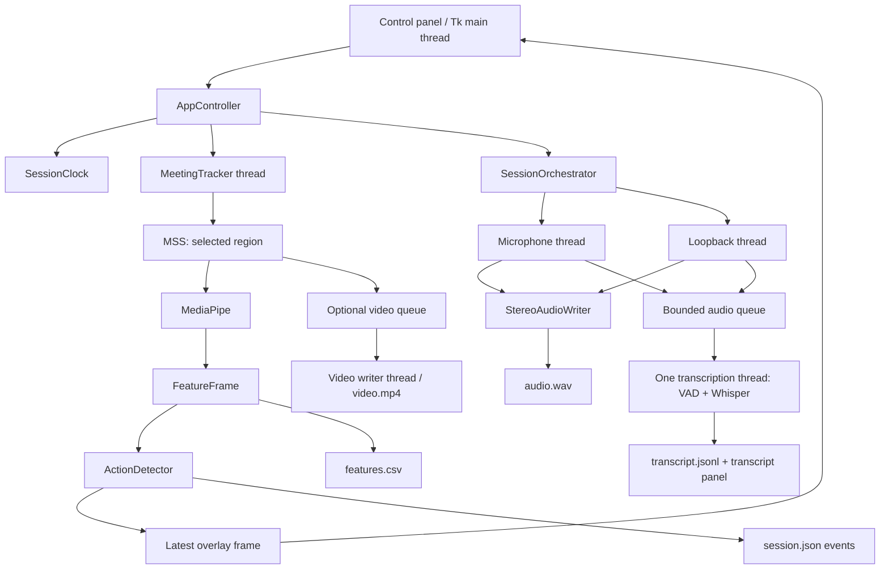

# Sổ tay hiểu và kiểm soát hệ thống

**Dự án:** AI-Assisted Real-Time Confusion Signal Detection and Teaching Support for Lecturers  
**Ứng dụng hiện tại:** Multimodal Dataset Collector (`facial-cue-prototype`)  
**Mốc đọc mã nguồn:** 27/09/2026  
**Cập nhật sửa lỗi và kiểm tra:** 29/09/2026; xem phần 13.  
**Mục đích:** giúp người phát triển hiểu hệ thống đang làm gì, tại sao, giới hạn ở đâu và nên cải tiến phần nào.

Đây là mô tả phiên bản code được kiểm tra ở thời điểm trên, không phải lời hứa về phiên bản tương lai. Khi code thay đổi, cần cập nhật tài liệu. Các tài liệu trong `docs/superpowers/` là lịch sử thiết kế, có thể khác implementation hiện tại.

## Cách đọc và mức độ bằng chứng

- **[CODE]:** xác nhận được bằng cách đọc mã nguồn hiện tại.
- **[ĐÃ ĐO]:** đã có phép đo cụ thể; xem điều kiện đo trước khi suy rộng.
- **[SUY LUẬN]:** rủi ro có cơ sở kỹ thuật nhưng chưa đo mức ảnh hưởng trong một buổi học thật.
- **[CẦN TEST]:** chưa có dữ liệu để kết luận đúng/sai hoặc mức độ chính xác.
- **[ĐỀ XUẤT]:** hướng cải tiến, chưa phải chức năng đã có.

Lộ trình đọc: phần 1–4 để hiểu kiến trúc; 5–8 để hiểu thuật toán; 9–12 để hiểu dữ liệu và hiệu năng; 13–16 để quyết định cải tiến. Có thể mở Markdown Preview trong VS Code để xem bảng và sơ đồ Mermaid. Các sơ đồ đều có phần giải thích bằng chữ.

## Mục lục

1. [Hệ thống thực sự là gì?](#1-hệ-thống-thực-sự-là-gì)
2. [Bản đồ cấu trúc code](#2-bản-đồ-cấu-trúc-code)
3. [Pipeline và các luồng chạy](#3-pipeline-và-các-luồng-chạy)
4. [Vòng đời một session](#4-vòng-đời-một-session)
5. [Hình ảnh, landmark và feature](#5-hình-ảnh-landmark-và-feature)
6. [Thuật toán nhận hành động](#6-thuật-toán-nhận-hành-động)
7. [Pipeline âm thanh](#7-pipeline-âm-thanh)
8. [Whisper, khoảng nghỉ và transcript](#8-whisper-khoảng-nghỉ-và-transcript)
9. [Timestamp và đồng bộ](#9-timestamp-và-đồng-bộ)
10. [Dữ liệu đầu ra](#10-dữ-liệu-đầu-ra)
11. [Các lần tối ưu và đánh đổi](#11-các-lần-tối-ưu-và-đánh-đổi)
12. [Điểm mạnh và giới hạn kiến trúc](#12-điểm-mạnh-và-giới-hạn-kiến-trúc)
13. [Vấn đề tìm được khi đọc code](#13-vấn-đề-tìm-được-khi-đọc-code)
14. [Bảng điều khiển kỹ thuật](#14-bảng-điều-khiển-kỹ-thuật)
15. [Kế hoạch kiểm thử và cải tiến](#15-kế-hoạch-kiểm-thử-và-cải-tiến)
16. [Kiến thức cần nắm và cách viết report](#16-kiến-thức-cần-nắm-và-cách-viết-report)

## 1. Hệ thống thực sự là gì?

Ứng dụng hiện tại là **công cụ thu thập và mô tả dữ liệu quan sát được** trong buổi học. Nó thu hình ảnh trong vùng đã chọn, ước lượng tín hiệu khuôn mặt, nhận một số chuyển động theo luật, và có thể ghi audio/video cùng transcript.

Tên đề tài có chữ “confusion”, nhưng code hiện tại **chưa có model nhận biết học sinh đang bối rối**, chưa có nhãn ground truth về confusion và chưa train model trên dataset của dự án.

### AI nằm ở đâu?

| Thành phần | Vai trò | AI hay luật? |
| --- | --- | --- |
| MediaPipe Face Landmarker | Ước lượng landmark, blendshape, ma trận khuôn mặt | Model AI đã được huấn luyện sẵn |
| Silero VAD | Ước lượng đoạn nào có tiếng nói | Model AI đã được huấn luyện sẵn |
| Whisper qua faster-whisper | Chuyển tiếng nói thành chữ và timestamp | Model AI đã được huấn luyện sẵn |
| Trích xuất yaw/pitch, trung bình blink | Biến output model thành số dễ phân tích | Công thức số học/hình học |
| ActionDetector | So số đo với baseline, ngưỡng và lịch sử | Luật + thống kê theo thời gian |
| MSS, Tkinter, CSV/WAV/MP4 | Capture, hiển thị và ghi dữ liệu | Hạ tầng phần mềm |

**Inference** là dùng model có sẵn để suy luận. **Training** là thay đổi trọng số model từ dữ liệu. Dự án hiện đang inference, không training. Hành động được xác định bằng luật nhưng đầu vào của luật vẫn là các ước lượng AI, nên vẫn có thể sai.

Ví dụ: `jaw_open=0.7` → luật có thể phát hiện mở hàm. Điều đó không chứng minh người đó đang nói, ngáp, ngạc nhiên hay bối rối.

## 2. Bản đồ cấu trúc code

Entry point hiện tại là ứng dụng desktop Tkinter, không có frontend web/backend HTTP.

| Nhóm | File | Trách nhiệm |
| --- | --- | --- |
| Khởi động | [main.py](../src/main.py) | Kiểm tra import, bật DPI awareness, tạo cửa sổ và controller |
| Điều phối | [app_controller.py](../src/app_controller.py) | Start, Stop, Pause, chọn vùng, tạo session, gọi final transcript |
| Giao diện | [control_panel.py](../src/control_panel.py) | Nút điều khiển, chỉ số và lịch cập nhật Tk |
| Chọn vùng | [region_selector.py](../src/region_selector.py), [capture_types.py](../src/capture_types.py) | Chuyển thao tác kéo chuột thành hình chữ nhật tọa độ desktop |
| Face loop | [meeting_tracker.py](../src/meeting_tracker.py) | Capture → MediaPipe → feature → action → output |
| Model face | [face_landmarker.py](../src/face_landmarker.py) | Tạo MediaPipe Tasks Face Landmarker |
| Feature | [feature_data.py](../src/feature_data.py) | Kiểu FeatureFrame, phép tổng hợp, góc đầu |
| Action | [action_detection.py](../src/action_detection.py) | Luật cho mắt, mày, miệng, đầu |
| Thời gian action | [action_temporal.py](../src/action_temporal.py), [action_types.py](../src/action_types.py) | Baseline, median, state machine và cấu hình |
| Overlay | [overlay_data.py](../src/overlay_data.py), [overlay_renderer.py](../src/overlay_renderer.py), [overlay_window.py](../src/overlay_window.py) | Giữ frame mới nhất, vẽ bitmap, đặt lên vùng capture |
| Windows | [windows_overlay.py](../src/windows_overlay.py), [windows_dpi.py](../src/windows_dpi.py) | Click-through, loại cửa sổ app khỏi capture, xử lý DPI |
| Session | [dataset_session.py](../src/dataset_session.py), [session_clock.py](../src/session_clock.py), [session_types.py](../src/session_types.py) | Folder, metadata, đồng hồ và lựa chọn thu dữ liệu |
| Feature CSV | [session_recorder.py](../src/session_recorder.py) | Serialize 89 cột dữ liệu |
| Media điều phối | [session_orchestrator.py](../src/session_orchestrator.py) | Khởi tạo và nối audio, video, live transcription |
| Audio input | [audio_devices.py](../src/audio_devices.py), [audio_recorder.py](../src/audio_recorder.py) | Thiết bị mặc định, PCM, packet audio |
| Audio output | [stereo_audio.py](../src/stereo_audio.py), [audio_quality.py](../src/audio_quality.py) | WAV stereo, mức âm lượng, gain |
| ASR | [transcription.py](../src/transcription.py), [final_transcription.py](../src/final_transcription.py) | Live worker, endpointing, Whisper, final pass |
| Transcript output | [transcript_writer.py](../src/transcript_writer.py), [transcript_panel.py](../src/transcript_panel.py) | JSONL và cửa sổ transcript |

`recording_session.py` và `action_event_recorder.py` giữ đường ghi CSV sự kiện kiểu cũ. `frame_processing.py` có helper của preview cũ. Sự tồn tại của file không có nghĩa entry point hiện tại dùng nó. Mặc định controller tạo `DatasetSession`.

`tests/` chứa kiểm thử; `scripts/` có lệnh tải model; `models/` chứa trọng số model; `.venv/` là môi trường thư viện. Không sửa trực tiếp `.venv` để thay đổi thuật toán của app.

**Môi trường đã đọc tại thời điểm viết:** Python 3.12.14; MediaPipe 0.10.21; OpenCV contrib 4.11.0.86; MSS 10.2.0; PyAudioWPatch 0.2.12.8; faster-whisper 1.2.1; SciPy 1.17.1. Các bản này khớp [requirements.txt](../requirements.txt), không phải khẳng định đó là phiên bản mới nhất ngoài thị trường.

## 3. Pipeline và các luồng chạy



Sơ đồ cho thấy hai nhánh chính: hình ảnh và âm thanh. Chúng dùng chung đồng hồ session, nhưng không đợi nhau xử lý xong.

### Thread không phải máy tính riêng

**Thread** là một luồng thực thi trong cùng process. Các thread vẫn dùng chung CPU, RAM và tài nguyên đĩa. Python còn có GIL cho nhiều đoạn mã Python; thư viện native có thể chạy ngoài GIL nhưng vẫn tranh CPU. Bốn thread Whisper không có nghĩa bốn core được dành riêng hoặc các core còn lại được bảo đảm cho landmark.

| Luồng | Công việc có thể chặn luồng |
| --- | --- |
| Tk main thread | Vẽ ảnh, cập nhật widget, nút gọi Start/Stop; load model và join worker có thể làm UI chờ |
| MeetingTracker | Capture, `detect_for_video`, feature/action, ghi CSV và event JSON |
| Audio microphone / system | Đọc device; gọi ghi WAV đồng bộ; đưa packet vào queue |
| Transcription | Vừa tích lũy buffer, vừa chạy VAD và Whisper; khi inference thì chưa xử lý packet tiếp |
| Video writer | Mã hóa và ghi MP4 |
| Final transcription | Đọc WAV, gọi Whisper lần lượt theo channel và interval |

### Ba kiểu lưu chờ cần phân biệt

**Latest slot của overlay/feature UI:** chỉ giữ frame mới nhất. UI chậm thì bỏ các phiên bản hiển thị cũ. Đây là chủ đích để không vẽ lại quá khứ; không đồng nghĩa xóa các dòng CSV đã ghi.

**Queue audio/video:** giữ nhiều phần tử theo thứ tự. Nó hấp thụ các khoảng xử lý chậm nhưng không tăng tốc model. Queue lớn hơn có thể đổi mất dữ liệu thành độ trễ lớn hơn.

**Buffer một utterance:** các mẫu âm thanh của một nguồn đang được gom thành đoạn cho Whisper. `You` và `Student` có buffer riêng, nhưng dùng chung một worker/model nên inference vẫn tuần tự.

## 4. Vòng đời một session

1. Mở app: tạo Tk, panel, controller; chưa bắt đầu capture.
2. Select Region: ẩn panel, mở lớp kéo chọn trên desktop. Không chụp ảnh toàn màn hình để làm ảnh nền chọn vùng.
3. Choose Save Folder và lựa chọn dữ liệu/consent.
4. Start: tạo đồng hồ, folder session, CSV và metadata; bật media tùy chọn, overlay, face worker.
5. Running: xử lý liên tục, mỗi frame có dữ liệu thời gian của nó.
6. Pause: tạm dừng face/audio/video; đồng hồ session vẫn chạy. Sự kiện action đang mở được ngắt.
7. Resume: cùng session; audio có interval mới để ánh xạ khoảng thời gian bị bỏ qua trong file WAV.
8. Stop: kết thúc worker, đóng output, rồi dự kiến cho phép Generate Final Transcript.
9. Chọn lại vùng khi đang chạy: kết thúc session hiện tại trước; không phải di chuyển ROI âm thầm trong cùng session.

Các state chính: `NO_REGION`, `READY`, `RUNNING`, `PAUSED`, `SHUTTING_DOWN`. State UI và action mode là hai hệ khác nhau: app có thể `RUNNING` nhưng action còn `CALIBRATING`.

**Cập nhật 29/09:** đã sửa đường Stop → Final và thêm test với DatasetSession, WAV, metadata thật. Khi Final chạy, trạng thái `FINALIZING` chặn Start, đổi vùng và đổi thư mục. Vẫn cần thử workflow UI với cuộc họp thực tế.

## 5. Hình ảnh, landmark và feature

### 5.1 Capture và overlay

ROI có `left`, `top`, `width`, `height`; MSS lấy đúng hình chữ nhật này. Đây là pixel đang hiển thị trên desktop, không phải luồng video gốc của Google Meet/Zoom. Cửa sổ khác che ROI hoặc meeting di chuyển thì nội dung được thu sẽ thay đổi; app không tự nhận diện lại học sinh.

MSS trả BGRA. App lấy BGR cho video và đảo kênh thành RGB cho MediaPipe. Các phép copy này có chi phí tăng theo diện tích ROI.

Overlay là cửa sổ Tk trong suốt, đặt lên ROI, click-through, không chiếm focus, được yêu cầu loại khỏi screen capture bằng Windows display affinity. Cách này tránh app tự thu lại mesh của nó. Nó phụ thuộc Windows và khả năng capture thực tế, không phải giải pháp bảo mật tuyệt đối.

### 5.2 MediaPipe

Code dùng **Tasks Face Landmarker**, model `face_landmarker.task`, chế độ `VIDEO`, tối đa một face. Các ngưỡng detection/presence/tracking đều 0.5; bật blendshapes và transformation matrix.

`VIDEO` ở đây chỉ là chế độ API, không có nghĩa bắt buộc đọc video file. App gọi `detect_for_video(image, timestamp_ms)` trên frame vừa capture. Lời gọi chặn face worker đến khi có kết quả. API có cơ chế tracking giúp giảm việc phát hiện lại; `LIVE_STREAM` là API bất đồng bộ khác và hiện chưa được dùng. [Tài liệu MediaPipe chính thức](https://developers.google.com/edge/mediapipe/solutions/vision/face_landmarker/python)

MediaPipe cung cấp vị trí landmark và các hệ số hình dạng mặt; code không tự train chúng. Landmark dùng trong RAM để vẽ và tính feature, nhưng không lưu toàn bộ mảng landmark vào CSV hiện tại.

### 5.3 Cách đọc số đo

| Giá trị | Code đang tính | Không nên hiểu thành |
| --- | --- | --- |
| `face_visible` | Có ít nhất một tập landmark | Người học đang chú ý |
| `confidence` | Hiện để `None`, CSV trống | Điểm tự tin detection đã được đo |
| `head_center_x/y` | Trung bình x/y của các landmark | Vị trí đầu trong đơn vị cm hoặc pixel desktop |
| `head_depth` | Trung bình z landmark | Khoảng cách thật từ đầu đến camera |
| yaw/pitch/roll | Góc Euler từ khối 3×3 đầu của ma trận MediaPipe | Góc đầu chính xác như cảm biến đã hiệu chuẩn |
| blink/gaze/brow/mouth | Tổng hợp blendshape scores | Xác suất confusion, emotion hoặc ý định |
| `strength` của action | Độ lệch chia ngưỡng | Xác suất; giá trị này có thể lớn hơn 1 |

Các hệ số blendshape thường trong khoảng 0–1, biểu diễn mức biểu hiện của dạng chuyển động model ước lượng. `0.8` không có nghĩa “chắc chắn đúng 80%”. Ngưỡng cấu hình `min_face_detection_confidence=0.5` cũng không phải dữ liệu confidence per-frame.

### 5.4 Công thức đang dùng

```text
blink = (eyeBlinkLeft + eyeBlinkRight) / 2
gaze_left = (eyeLookOutLeft + eyeLookInRight) / 2
gaze_right = (eyeLookInLeft + eyeLookOutRight) / 2
gaze_up/down = trung bình eyeLookUp/Down của hai mắt
brow_raise = max(browInnerUp, browOuterUpLeft, browOuterUpRight)
mouth_activity = max(jawOpen, smileLeft, smileRight, pucker, funnel)
```

Nếu thiếu thành phần cần thiết, phép tổng hợp trả `None`; không tự thay số thiếu bằng 0.

Với ma trận `R` trong trường hợp thông thường:

```text
yaw   = asin(clamp(-R[2,0], -1, 1))
pitch = atan2(R[2,1], R[2,2])
roll  = atan2(R[1,0], R[0,0])
```

Sau đó đổi radian sang độ; code có nhánh riêng cho gần gimbal lock. Code lấy khối 3×3 như rotation mà không trực chuẩn hóa hoặc tách scale. Đây là giới hạn cần nhớ nếu dùng các góc cho phân tích định lượng. Dấu trái/phải còn cần xác nhận với video mirror và quy ước camera.

Gaze ở đây là proxy từ chuyển động mắt, không phải tọa độ nhìn chính xác trên màn hình. Không có hiệu chuẩn gaze bằng các điểm nhìn chuẩn hoặc bù đầy đủ tư thế đầu.

## 6. Thuật toán nhận hành động

### 6.1 Baseline cá nhân

App lấy tối thiểu **30 frame hợp lệ và 2 giây thời gian mặt liên tục tích lũy**. Chỉ cộng khoảng cách giữa hai frame hợp lệ nếu khoảng cách không quá 0.25 s. Mất mặt làm ngắt liên tục, nhưng mẫu baseline đã thu vẫn được giữ. Sau calibration, baseline được cố định cho phiên tracker đó.

Người dùng nên nhìn và ngồi tự nhiên trong giai đoạn này. Nếu bắt đầu bằng há miệng/nhướng mày, baseline sẽ coi trạng thái đó gần với bình thường. Đây không phải huấn luyện model mới; chỉ là thống kê tham chiếu cá nhân.

Với feature `x`:

```text
b = median(các mẫu baseline)
MAD = median(|x_i - b|)
s = median(các giá trị trong cửa sổ 0.25 s gần nhất)
delta = s - b
threshold = max(floor, 6 * MAD) / sensitivity
strength = max(0, direction * delta) / threshold
```

Median là giá trị giữa sau khi sắp xếp, ít bị một spike kéo lệch hơn trung bình. MAD là thước đo độ phân tán quanh median. Hệ số 6, các floor và sensitivity là lựa chọn heuristic của dự án, chưa có benchmark xác nhận là tối ưu.

Ví dụ yaw baseline 4°, MAD 1°, floor 15°, sensitivity 1: ngưỡng là 15°. Yaw đã làm mượt 22° cho delta 18° và strength 1.2. Vượt ngưỡng chưa đủ; còn cần điều kiện thời gian.

### 6.2 State machine và hysteresis

Một hành động thường cần strength ≥ 1.0 trong **0.25 s** để bật. Khi strength xuống dưới **0.60**, chờ **0.15 s** rồi mới kết thúc. Sau đó cooldown **0.30 s** trước lần kích hoạt tiếp theo. Bất đối xứng mày/mắt dùng hold 0.30 s; một số hành động temporal có hold bằng 0.

Hai ngưỡng bật/tắt khác nhau gọi là **hysteresis**, giúp nhãn không bật tắt liên tục khi số dao động gần ngưỡng. Hold/cooldown cũng là nguyên nhân nhãn hành động cố ý xuất hiện chậm hơn raw landmark.

```text
Chưa hoạt động → ứng viên vượt ngưỡng → giữ đủ lâu → đang hoạt động
→ xuống dưới ngưỡng tắt → giữ đủ lâu → phát event → cooldown
```

Không cộng đơn giản mọi hằng số thành một độ trễ cố định. Median, cadence frame và thời điểm vượt ngưỡng cùng quyết định độ trễ thực.

### 6.3 Hệ thống đang nhận những gì?

| Nhóm | Action ID | Cách xét chính |
| --- | --- | --- |
| Quay đầu | `head_turned_left/right` | Yaw tương đối, floor 15° |
| Ngẩng/cúi | `head_raised/lowered` | Pitch tương đối, floor 12° |
| Nghiêng | `head_tilted_left/right` | Roll tương đối, floor 12° |
| Mắt nhìn | `eyes_looking_left/right/up/down` | Delta gaze floor 0.30, chọn hướng mạnh nhất với dominance margin 0.08 |
| Mày | `inner_brows_raised`, `brows_raised`, `brows_lowered`, `asymmetric_brow_movement` | Inner-up 0.15; raise 0.20; down 0.15; bất đối xứng 0.18 |
| Miệng | `jaw_opened`, `smile_movement_detected`, `mouth_puckered`, `mouth_funnel_detected`, `mouth_movement_detected` | Floors lần lượt 0.20, 0.20, 0.18, 0.15, 0.12 |
| Mắt nhắm | `blinking`, `long_eye_closure`, `asymmetric_eye_closure`, `frequent_blinking` | Điều kiện thời gian, mức blink và chênh hai mắt |
| Đầu động | `nodding`, `shaking_head`, `head_movement_detected`, `head_mostly_still` | Biến đổi góc theo lịch sử |
| Trạng thái mặt | `face_not_detected`, `face_detected_again` | Mất mặt xác nhận sau 0.20 s, rồi tái xuất hiện |

Gaze action được so với baseline, nhưng dòng Gaze trên panel gọi `gaze_label()` trên raw feature với ngưỡng 0.2. Vì thế panel có thể ghi “Down” trong khi overlay chưa có `eyes_looking_down`. Đây là hai phép diễn giải khác nhau trong code, không phải cùng một nhãn.

### 6.4 Blink và chuyển động đầu

Blink threshold: `max(0.55, baseline_blink + 6*MAD) / sensitivity`. Để ghi blink cần ít nhất 2 frame đóng mắt và duration ≥ 0.05 s khi mắt mở lại. Nhắm ≥ 0.80 s là long closure. Blink ngắn được giữ hiển thị 0.35 s; từ 4 blink trong cửa sổ 8 s kích hoạt frequent blinking. Bất đối xứng mắt dùng chênh hệ số hai mắt và floor 0.25.

Nodding/shaking tìm các lần đảo chiều góc trong 1.5 s gần nhất, cần ít nhất hai excursion đủ lớn: pitch 10° cho nodding, yaw 12° cho shaking. Đó là mẫu dao động theo luật, không hiểu ý nghĩa “đồng ý/không đồng ý”. Chuyển động đầu chung dùng tổng tốc độ tuyệt đối yaw/pitch/roll với mốc 20°/s. Stillness cần span ít nhất 1.5 s và range mỗi góc dưới 3° trong lịch sử giữ tối đa 2 s.

Median 0.25 s có thể làm mất các blink rất ngắn; FPS thấp khiến không đủ 2 frame. Do đó đếm blink cần test riêng, không chỉ kiểm tra nhìn thấy mặt.

### 6.5 Hành động nào được hiển thị?

Overlay chỉ lấy tối đa 4 action. Nhãn cụ thể được ưu tiên hơn nhãn chung, sau đó xét duration, strength. Ví dụ đang nodding thì ẩn `head_movement_detected`; đang jaw-open thì ẩn nhãn mouth-movement chung. Event được tạo riêng trước bước giới hạn hiển thị, nên danh sách overlay không phải toàn bộ lịch sử event.

Gap frame >0.25 s sẽ ngắt trạng thái temporal. Khi hệ thống lag, không chỉ UI chậm: các action kéo dài cũng có thể bị ngắt, làm dataset khác đi.

## 7. Pipeline âm thanh

Thiết bị được lấy qua PyAudioWPatch: microphone mặc định và WASAPI loopback của đầu ra âm thanh mặc định. Loopback là âm thanh máy đang phát, không tách riêng app Meet/Zoom. `You` và `Student` là nhãn nguồn kỹ thuật, không phải speaker diarization hoặc nhận diện danh tính. Tiếng thông báo, app khác hoặc tiếng mic lọt lại vào loa có thể đi vào kênh Student.

Mỗi lần đọc **1024 frame audio PCM16** ở sample rate của thiết bị. “Frame audio” là một thời điểm chứa mẫu của các channel, không phải frame video. Ở 48 kHz, 1024 frame tương đương khoảng **21.33 ms**. Audio nhiều channel được trung bình về mono cho xử lý.

### Ghi WAV

`StereoAudioWriter` resample về 48 kHz khi cần, đặt microphone ở trái và loopback ở phải, ghi PCM16 stereo. Nó giữ khoảng đệm 0.5 s để ghép hai nguồn theo timestamp; nguồn thiếu được điền silence. Packet đến quá muộn bị từ chối. Ghi WAV xảy ra trong callback audio với lock, không có worker ghi WAV riêng.

Điều này thuận tiện vì chỉ có một file, nhưng I/O chậm có thể ảnh hưởng tốc độ nhận audio. Chưa có đo drift phần cứng dài hạn. Việc nhánh ASR không xóa audio gốc không có nghĩa WAV được bảo đảm tuyệt đối không mất dữ liệu.

### Mức âm lượng và tiền xử lý

```text
RMS = sqrt(mean(sample^2))
peak = max(abs(sample))
gain = min(8, max(1, 0.10/RMS), 0.98/peak)
```

RMS <0.0005 được coi gần như không tín hiệu; <0.01 là quá nhỏ; peak ≥0.98 là clipping. Với RMS quá nhỏ, app không khuếch đại. Các ngưỡng trên là giá trị biên độ số, không phải dB SPL hoặc mức âm thanh vật lý đã hiệu chuẩn.

Gain chỉ áp dụng cho bản audio đưa vào inference; không phải bộ khử ồn, không sửa clipping đã tồn tại và không chứng minh chất lượng phát âm. Resampling đổi số mẫu/giây bằng `resample_poly`, không tăng thông tin gốc.

## 8. Whisper, khoảng nghỉ và transcript

### 8.1 Pipeline live

```text
Audio packet → queue 4096 packet → buffer riêng từng nguồn
→ đủ 1.2 s: kiểm tra khoảng nghỉ mỗi 0.1 s audio mới
→ VAD chỉ xem 2 s cuối (ngưỡng nghỉ 1 s + 1 s ngữ cảnh)
→ nghỉ đủ 1 s hoặc buffer đạt 12 s
→ Whisper nhận toàn bộ đoạn đã gom
→ word timestamps → nhóm theo khoảng nghỉ → JSONL + panel
```

2 s chỉ là cửa sổ phát hiện kết thúc; không phải Whisper chỉ nghe 2 s. Khi cắt bắt buộc do đạt 12 s, giữ overlap 0.75 s. Khi chốt theo khoảng nghỉ, không giữ overlap đó. Stop/gap có thể flush đoạn chưa đủ cửa sổ.

Queue 4096 gói tương đương khoảng 43.7 s tổng thời gian thực với hai nguồn 48 kHz/1024 frame. Đây là phép ước lượng dung lượng, không phải delay mục tiêu. Khi queue đầy, code bỏ packet cũ nhất để nhận packet mới. Mất thứ tự index làm tách buffer để không nối âm thanh qua khoảng bị mất như thể liên tục.

### 8.2 Những model/tham số đang dùng

Live ưu tiên folder `faster-whisper-small-en`; không có thì dùng `base-en`. CPU INT8, `beam_size=5`, `cpu_threads=4`, `num_workers=1`, language cố định English, `word_timestamps=True`. VAD có threshold 0.35 và minimum silence 1000 ms. Thư viện hỗ trợ VAD và word timestamps; code dự án quyết định các ngưỡng/queue. [faster-whisper chính thức](https://github.com/SYSTRAN/faster-whisper)

**Beam search** giữ nhiều giả thuyết chữ để tìm chuỗi phù hợp; beam lớn hơn tốn tính toán và không bảo đảm luôn đúng hơn. **INT8** giảm độ chính xác biểu diễn số để tiết kiệm tài nguyên; không nên tự coi kết quả bit-for-bit giống mọi chế độ khác.

Mỗi lời gọi `transcribe()` nhận một đoạn audio. Dự án không có cơ chế rolling text prompt giữa các lời gọi live. Whisper cũng không được fine-tune riêng cho giọng người học hoặc thuật ngữ môn học.

### 8.3 Vì sao cần VAD và vì sao 1 giây?

VAD phân biệt speech/non-speech, không hiểu câu. Nó không chỉ kiểm tra audio có biên độ bằng 0. Endpointing quyết định lúc nào có thể chốt đoạn; ngưỡng ngắn dễ cắt nhầm khi người học đang nghĩ, ngưỡng dài tăng thời gian chờ.

**1.0 s là lựa chọn kỹ thuật trong khoảng 0.8–1.2 s người dùng đề xuất, chưa phải ngưỡng tối ưu đã được chứng minh.** Nghiên cứu endpointing thảo luận trade-off giữa cắt sớm và latency, không xác nhận một ngưỡng cố định đúng cho mọi lớp học. [Two-pass Endpoint Detection for Speech Recognition](https://arxiv.org/abs/2401.08916)

Tạm nghỉ có thể nằm giữa câu, còn hai câu có thể nói liền. Tên chính xác trong report là **pause-delimited utterance**, không khẳng định phân tích được mọi câu ngữ pháp.

### 8.4 Tách dòng và timestamp

Nhóm các word từ decoder, kể cả qua ranh giới decoder segment, đến khi khoảng cách giữa end word trước và start word sau ≥1 s. Dòng mới bắt đầu từ word tiếp theo. Timestamp dòng lấy first word start và last word end, cộng thời gian bắt đầu audio chunk. Nếu không có word timestamps, giữ segment/timestamp decoder làm fallback.

Panel hiển thị nhãn nguồn và **start time làm tròn một chữ số thập phân**. JSONL lưu cả start/end ở độ chính xác số thực. Dòng chữ xuất hiện sau khi inference hoàn tất, không phải đúng lúc người đó bắt đầu nói.

### 8.5 Final transcript

Khi được kích hoạt, final đọc WAV theo cửa sổ tối đa 30 giây, overlap 0.75 giây khi phải cắt một interval dài. Hai channel được xử lý lần lượt trong mỗi cửa sổ. Không còn đọc toàn WAV vào RAM; các dòng transcript được ghi qua iterator vào file tạm, chỉ thay file chính khi hoàn tất. Ưu tiên model `medium-en`, rồi `small-en`, rồi `base-en` theo folder hiện có. Không được nói chắc final dùng medium nếu chưa cài.

Nó dùng cùng quy tắc nhóm theo pause, nhưng ngữ cảnh khác nên chữ/timestamp có thể khác live. JSONL giữ dòng live, thay dòng final cũ bằng dòng final mới qua file tạm và replace. Final không phải phép sửa lại trực tiếp từng dòng live.

Code có cancellation nhưng không ngắt được ngay giữa một lần suy luận. Lỗi hoặc hủy trước khi hoàn tất giữ lại transcript cũ. Cửa sổ 30 giây giới hạn RAM nhưng có thể cắt giữa câu; overlap và cutoff giảm trùng, không bảo đảm tuyệt đối không lặp/mất từ ở ranh giới. Chất lượng ở ranh giới cần kiểm tra bằng audio có lời thật.

## 9. Timestamp và đồng bộ

### 9.1 Ba loại thời gian

| Loại | Ví dụ | Dùng để làm gì? |
| --- | --- | --- |
| Event/capture time | Frame được thu ở giây 12.4 | Ghép dữ liệu mặt với nội dung âm thanh |
| Processing time | MediaPipe mất 25 ms | Đo chi phí xử lý |
| Display time | Transcript hiện ở giây 16.2 | Đo trải nghiệm/latency |

`SessionClock` dùng `perf_counter()` tương đối từ Start; thời gian lịch được lưu riêng. Pause không dừng clock. Audio timestamps hiện được lấy trước/sau thao tác đọc stream, không phải timestamp phần cứng của từng sample. Cùng clock là cần thiết nhưng chưa đủ để chứng minh đồng bộ sample-accurate.

Ví dụ học sinh nói từ 12.2 đến 15.4 s, câu hiện ở 17 s. Khi phân tích mặt liên quan câu đó, dùng frame timestamp nằm trong 12.2–15.4 s, không dùng mặt lúc 17 s. Không trì hoãn overlay để chờ chữ, vì nó sẽ lệch với video meeting hiện tại.

### 9.2 Các chỉ số UI thực sự đo gì?

- `processing_ms` / Landmark latency: bắt đầu trước MSS grab và kết thúc sau extract feature. Chưa tính action detector, ghi file, queue UI, render hoặc màn hình vật lý. Không phải capture-to-display latency đầy đủ.
- FPS: nghịch đảo khoảng cách timestamp hai frame, không phải tốc độ display của màn hình.
- Transcript lag: thời gian sau inference trừ end của audio chunk; chunk có thể chứa trailing silence. Không bằng thời gian từ word cuối đến lúc chữ được vẽ.
- `Dropped` của worker hiện cộng cả một số lỗi inference, nên không phải chỉ đếm packet overflow thuần túy.
- `frame_gap_ms`: giúp thấy việc lấy mẫu không đều; `capture_drop_count` hiện mặc định 0, chưa là bộ đếm đầy đủ.

### 9.3 Audio/video sau Pause

WAV không chèn toàn bộ thời gian Pause; `audio.intervals` trong session.json liên hệ vị trí WAV và session time. Ví dụ WAV giây 10 có thể tương ứng session giây 15 sau Pause 5 s.

MP4 dùng CFR 20 FPS và resampling theo session timestamp. Slot frame là `floor(timestamp_s * 20)`: capture chậm thì lặp ảnh trước đó, capture nhanh hơn 20 FPS thì bỏ ảnh rơi vào slot đã có. Trước ảnh đầu và trong Pause dùng khung đen; không lấy thêm màn hình khi Pause. Thời gian video vì vậy theo session clock với độ phân giải 50 ms, không phải phép đo sample-accurate.

Trong lúc recording, `video_frame_index` trong CSV để trống. Worker ghi mapping nguồn sang frame sau khi `VideoWriter.write()` trả về thành công, rồi Stop tổng hợp mapping vào CSV theo luồng đọc/ghi. Frame không được ghi hoặc bị bỏ do resampling giữ ô trống. `video-map.tmp` phục vụ bước này và được xóa sau khi tổng hợp thành công. Nếu crash/lỗi đĩa, file tạm có thể còn để phục hồi; không tự xóa chúng. OpenCV không cung cấp xác nhận bền vững từng frame trên đĩa; test tích hợp có đọc lại MP4 thật, nhưng lỗi driver/codec hoặc hỏng file vẫn cần kiểm tra.

## 10. Dữ liệu đầu ra

```text
session_001/
  session.json
  features.csv
  audio.wav          (khi bật audio)
  transcript.jsonl   (khi bật transcript)
  video.mp4          (khi bật video)
```

Không có bản audio riêng cho You/Student: hai nguồn nằm ở hai channel của một WAV. Video MP4 và WAV là file riêng, chưa mux thành một video có tiếng.

### 10.1 features.csv: 89 cột hiện tại

| Nhóm | Cột |
| --- | --- |
| Thời gian/hiện diện | `timestamp_s`, `frame_index`, `face_visible`, `confidence` |
| Vị trí/góc | `head_center_x`, `head_center_y`, `head_depth`, `head_yaw_deg`, `head_pitch_deg`, `head_roll_deg` |
| Gaze | `gaze_left`, `gaze_right`, `gaze_up`, `gaze_down` |
| Blink | `blink_left`, `blink_right`, `blink` |
| Brow | `brow_inner_up`, `brow_outer_up_left`, `brow_outer_up_right`, `brow_down_left`, `brow_down_right`, `brow_raise` |
| Mouth | `jaw_open`, `mouth_smile_left`, `mouth_smile_right`, `mouth_pucker`, `mouth_funnel`, `mouth_activity` |
| Chất lượng/capture | `processing_ms`, `frame_gap_ms`, `capture_drop_count`, `video_frame_index` |
| Action snapshot | `action_mode`, `action_calibration_progress`, `active_action_ids`, `active_action_strengths` |
| Blendshape | 52 cột `blendshape_*` theo danh mục trong `session_recorder.py` |

Mỗi dòng ứng với một frame được xử lý, không phải sampling rate cố định. Mất mặt vẫn ghi dòng thời gian và `face_visible=false`; các giá trị không có để trống. `active_action_ids/strengths` dùng chuỗi phân cách `|` và phản ánh các action đã được rank/giới hạn trong snapshot.

52 tên blendshape gốc để tra code:

```text
_neutral
browDownLeft, browDownRight, browInnerUp, browOuterUpLeft, browOuterUpRight
cheekPuff, cheekSquintLeft, cheekSquintRight
eyeBlinkLeft, eyeBlinkRight, eyeLookDownLeft, eyeLookDownRight
eyeLookInLeft, eyeLookInRight, eyeLookOutLeft, eyeLookOutRight
eyeLookUpLeft, eyeLookUpRight, eyeSquintLeft, eyeSquintRight
eyeWideLeft, eyeWideRight
jawForward, jawLeft, jawOpen, jawRight
mouthClose, mouthDimpleLeft, mouthDimpleRight, mouthFrownLeft, mouthFrownRight
mouthFunnel, mouthLeft, mouthLowerDownLeft, mouthLowerDownRight
mouthPressLeft, mouthPressRight, mouthPucker, mouthRight
mouthRollLower, mouthRollUpper, mouthShrugLower, mouthShrugUpper
mouthSmileLeft, mouthSmileRight, mouthStretchLeft, mouthStretchRight
mouthUpperUpLeft, mouthUpperUpRight, noseSneerLeft, noseSneerRight
```

Code đổi camelCase sang snake_case và thêm `blendshape_`. Dữ liệu này là output model tương đối thô, **không phải raw pixel hoặc raw landmark đầy đủ**.

### 10.2 session.json

Schema version hiện là `3.0`. Chứa session ID, participant ID, thời điểm bắt đầu/kết thúc, duration, ROI, tùy chọn, consent flag, components, warnings/errors/drops, audio intervals, transcription status và danh sách `observable_events`.

Event có `start_time_s`, `end_time_s`, `action`, `duration_s`, `peak_strength`, `status`. `completed` và `interrupted` cần phân biệt khi phân tích. Ví dụ event bị ngắt bởi mất mặt không chứng minh hành động kết thúc tự nhiên.

Metadata có một số trường/API chưa được luồng chạy điền đầy đủ. Không suy ra `drops={}` nghĩa chắc chắn không drop. Phiên bản model/config live cũng chưa được ghi đầy đủ dù có setter hỗ trợ.

### 10.3 transcript.jsonl

Mỗi dòng là một JSON object độc lập với `segment_id`, `start_s`, `end_s`, `source`, `speaker`, `text`, `language`, `phase`, `status`. Phase `live` có status `committed`; phase `final` có status `canonical`.

`canonical` chỉ là nhãn chọn bản final của app, không phải ground truth đã được con người kiểm chứng. Segment ID có thể bắt đầu lại ở final; khi phân tích nên phân biệt ít nhất session + phase + segment_id. File có thể chứa cả hai phase, không mặc định mọi dòng đã sắp xếp chung theo thời gian.

### 10.4 Những thứ chưa có

Không có nhãn confusion đáng tin cậy, nhận diện danh tính, diarization nhiều người thật, confidence ASR đã hiệu chuẩn, word-level array lưu riêng, toàn bộ landmark lưu từng frame, hoặc chứng nhận đồng bộ chính xác phần cứng. Không có bước training trong app.

## 11. Các lần tối ưu và đánh đổi

| Thay đổi đã làm | Vấn đề giải quyết | Điều chưa giải quyết / đánh đổi |
| --- | --- | --- |
| Overlay trực tiếp, capture exclusion | Tránh preview bị capture lặp | Phụ thuộc Windows; vẫn phải render ảnh overlay |
| Latest slot cho UI | Tránh vẽ hàng dài frame cũ | UI bỏ frame trung gian; không phải mọi frame đều xuất hiện |
| Giới hạn Whisper 4 thread | Hạn chế mức tranh CPU | Không cô lập core; có thể làm inference riêng lẻ chậm hơn |
| Cửa sổ 5 → 3 s trước đây | Giảm thời gian tích lũy ban đầu | Đã gây mất ngữ cảnh; hiện thay bằng endpointing thích nghi |
| Queue 24 → 4096 packet | Hấp thụ thời gian decoder bận | Queue lớn có thể tích lũy hàng chục giây lag |
| Phát hiện packet gap | Không nối các đoạn audio thiếu như liên tục | Không khôi phục được phần live đã bỏ |
| Pause 1 s + word timestamp grouping | Dòng chữ theo khoảng nghỉ | Tốn alignment và bắt buộc phải chờ pause |
| VAD quét toàn đoạn → 2 s cuối | Loại chi phí quét lặp tăng theo câu | VAD chỉ có ngữ cảnh gần; cần test endpoint thực |
| Cache ánh xạ 52 blendshape | Loại tìm kiếm/regex lặp mỗi frame | Không loại latency ổ đĩa |
| Publish overlay trước ghi CSV | Frame hiện tại không phải đợi ghi row mới được publish | Frame tiếp theo vẫn đợi phần ghi đồng bộ |
| Batch callback ≤32 hoặc khoảng 4 ms | Nhường Tk cho redraw | Một callback chậm vẫn không bị ngắt giữa chừng |
| Không copy video frame khi tắt video | Giảm bộ nhớ/băng thông không cần thiết | RGB capture/inference vẫn cần xử lý |
| Gain giới hạn theo peak | Không tạo thêm clipping khi khuếch đại | Không khử noise hay phục hồi âm méo gốc |

### Số đo đã có

| Phép đo | Trước | Sau |
| --- | --- | --- |
| VAD endpoint check với buffer 12 s | 45.48 ms | 7.80 ms |
| VAD endpoint check với buffer 6 s | 22.67 ms | 7.80 ms |
| VAD endpoint check với buffer 2 s | 7.76 ms | 8.51 ms |
| Serialize CSV một frame | 2.599 ms | 0.079 ms |

**[ĐÃ ĐO]** VAD dùng synthetic Gaussian noise seed 42, 48 kHz, trung bình 5 lần sau warm-up. CSV dùng 200 dòng ghi StringIO trong RAM. Không có camera, microphone hay participant audio trong các microbenchmark này. Không suy ra toàn app nhanh hơn 5.8 hoặc 33 lần: chỉ một phần đường chạy được cải thiện. Biến động nhỏ ở case 2 s cũng cho thấy cần đo nhiều lần hơn.

Ở lượt kiểm tra trước, 177 test đã pass. Đây là snapshot kiểm thử logic, không phải 177 buổi học hoặc đo accuracy. Tài liệu này không chạy lại hardware benchmark. Xem thêm [transcription-methodology.md](transcription-methodology.md).

## 12. Điểm mạnh và giới hạn kiến trúc

### Điểm mạnh xác nhận từ code

- Module tương đối rõ: có thể thay model/transcriber/capture bằng factory, thuận tiện test.
- Model chạy local sau khi đã tải; pipeline runtime không có dịch vụ transcription cloud.
- Cùng session clock giúp đặt nền tảng ghép các modality.
- Giữ feature liên tục kể cả mất mặt; giá trị thiếu được phân biệt với số 0.
- Có raw-ish coefficients song song với action diễn giải; về sau có thể chạy lại luật trên CSV.
- Baseline cá nhân, smoothing và hysteresis có lý do rõ ràng, dễ giải thích hơn một nhãn tâm lý không có dữ liệu.
- Lưu cả live và final để đối chiếu; tách hai nguồn âm vào hai channel.
- File tạm rồi replace giảm khả năng đọc JSON/JSONL đang bị ghi dở, dù không bảo đảm crash durability tuyệt đối.

### Giới hạn biết được ngay

**Độ trễ:** inference, VAD, I/O và Tk còn dùng chung process. Face pipeline có nhiều bước đồng bộ. Không có cam kết hard real-time.

**Ngữ nghĩa:** gaze là proxy, blink/action là heuristic, transcript là ASR. Không thành phần nào chứng minh trạng thái tâm lý hoặc hiểu nội dung bài học của người học.

**Cá nhân hóa:** baseline được lấy đầu phiên rồi cố định. Đổi tư thế camera, ánh sáng hoặc khuôn mặt xuất hiện khác có thể làm baseline không còn phù hợp. Không có identity tracking để biết người trong ROI đã thay đổi.

**Thu dữ liệu:** chỉ capture hình ảnh hiển thị sau khi meeting đã xử lý/nén/truyền mạng. Không biết chính xác latency từ camera học sinh đến desktop giảng viên.

**Nền tảng:** ROI và overlay phụ thuộc Windows, loopback không cô lập app, UI transcript đa màn hình còn dùng kích thước màn hình chính để đặt vị trí.

**Tài nguyên dài hạn:** final đọc cả WAV vào RAM; observable_events giữ trong list và ghi lại toàn bộ session JSON khi thêm event. Buổi dài có thể tăng chi phí I/O/RAM.

**[CẦN TEST]** độ chính xác theo người, kính, góc mặt, ánh sáng, accent, thuật ngữ, nền ồn, cả hai người nói cùng lúc, nhiều màn hình/DPI và session dài. Không có đủ bằng chứng để nêu một tỷ lệ chính xác chung.

## 13. Vấn đề tìm được khi đọc code

Danh sách ban đầu ngày 27/09 đã được đối chiếu và sửa ngày 29/09. Bảng dưới ghi trạng thái hiện tại, không coi mọi rủi ro là đã được loại bỏ.

| Ưu tiên | Phát hiện và căn cứ | Ảnh hưởng | Việc xác minh/sửa cần làm |
| --- | --- | --- | --- |
| Cao | Stop dùng biến recorder chưa gán | **Đã sửa**, giữ thư mục session từ recorder hiện tại | Regression test Start audio → Stop → Final với DatasetSession thật, giả lập job Final |
| Cao | MP4 bỏ qua timestamp | **Đã sửa**, CFR theo clock, lặp frame và khung đen Pause | Test FPS biến thiên, Pause; đọc lại MP4 thật đối chiếu duration |
| Cao | Reserve index trước khi ghi, bỏ queue khi Stop | **Đã sửa**, mapping sau write, Stop drain queue | Test queue đầy, Stop, writer failure; CSV khớp index MP4 thật |
| Cao | Lỗi khởi tạo để lại orchestrator | **Đã sửa**, dùng đường cleanup chung | Test lỗi overlay sau khi optional capture đã khởi động |
| Cao | Lỗi VAD/inference bị nuốt | **Đã sửa**, error callback với stage/source/time và trạng thái ERROR | Worker lỗi dừng nhận audio live; WAV vẫn độc lập, không giả vờ transcript khỏe |
| Trung bình | Audio writer từ chối packet | **Đã sửa**, đếm theo nguồn và khoảng thời gian | `drops`, `drop_details`; khoảng liên tiếp được gộp |
| Trung bình | Thiếu stats/config | **Đã nối**, `media_stats`, config live Whisper và phiên bản Python/package | Đây chưa phải snapshot bit-for-bit: chưa hash model hoặc toàn bộ source code |
| Trung bình | Một worker cho hai nguồn, queue lớn | **Đã thêm đo**, RTF theo lần inference, queued duration từng nguồn | Cần đo khi nói thật đồng thời; queue duration chưa bao gồm audio đã lấy vào buffer/inference |
| Trung bình | Start chạy khi Final đang làm | **Đã sửa**, `FINALIZING` và guard controller | Test nút UI và gọi Start trực tiếp |
| Trung bình | Đọc toàn WAV, rewrite JSON mỗi event | **Đã sửa**, cửa sổ audio 30 s; append event journal | `events.tmp.jsonl` tổng hợp vào `session.json` khi đóng; phần tổng hợp cuối vẫn dùng RAM theo số event |
| Trung bình | Median blink 0.25 s có thể mất blink ngắn | **Chưa đổi thuật toán** | Cần clip có nhãn để đo precision/recall; không coi đổi ngưỡng tùy ý là cải thiện độ chính xác |

Kiểm tra rộng hơn còn sửa: không đóng PyAudio khi mở stream lỗi; không đóng stream khi stop_stream lỗi; WAV/CSV không close khi flush lỗi; CSV còn mở nếu khởi tạo manifest thất bại; parent bị ẩn nếu tạo cửa sổ chọn vùng thất bại; đóng transcript bằng X làm callback chạm widget đã hủy; lỗi loại trừ capture để lại cửa sổ transcript không được bảo vệ. Các nhánh này có regression test.

Lệnh kiểm tra không cần camera/cuộc họp:

```powershell
.\.venv\Scripts\python.exe -m unittest discover -s tests -q
.\.venv\Scripts\python.exe -m pip check
```

Đã kiểm tra cú pháp toàn bộ 73 file Python bằng `compile()` trong RAM. `compileall` mặc định bị chặn ghi `__pycache__` bởi quyền môi trường kiểm tra, không phải lỗi cú pháp. Đã smoke-test model MediaPipe thật với ảnh trống và Whisper small.en thật với audio im lặng, không capture dữ liệu cá nhân. Các test này không đánh giá độ chính xác AI.

**Cần kiểm tra thủ công:** session 1-2 phút với hai nguồn audio, Pause 5 giây rồi Resume, Stop → Final, đóng transcript bằng X, chọn lại vùng, màn hình phụ/DPI; mở CSV và MP4 sau Stop để đối chiếu một chuyển động dễ thấy. Đo backlog với hai người nói và thử buổi dài. Native inference không thể bị ngắt tức thì; Stop/Final có thể phải chờ, lỗi đĩa/driver có thể để session incomplete. Test xanh không có nghĩa toàn hệ thống không còn lỗi.

## 14. Bảng điều khiển kỹ thuật

| Muốn thay đổi | Chỉnh ở đâu | Hiệu ứng cần cân nhắc |
| --- | --- | --- |
| Độ nhạy action | `ActionDetectionConfig.sensitivity` | Tăng sensitivity hạ ngưỡng, dễ false positive |
| Thời gian calibration | `baseline_duration_s`, `baseline_min_samples` | Dài hơn có thể ổn định hơn nhưng khởi động lâu |
| Độ mượt vs phản ứng | `smoothing_window_s` | Dài hơn mượt nhưng có thể mất chuyển động ngắn |
| Hold/release | `minimum_action_duration_s`, `release_duration_s` | Giảm delay có thể làm nhãn nhấp nháy |
| Ngưỡng từng hành động | `_update_static`, `_brow_strengths`, `_mouth_strengths` | Phải kiểm tra trên nhiều người, không chỉnh theo một clip |
| Khoảng nghỉ transcript | `UTTERANCE_PAUSE_S` | Ảnh hưởng cả endpoint live và word grouping; hiện 1 s |
| Cadence VAD | `ENDPOINT_CHECK_S` | Dày hơn giảm trễ kiểm tra, tăng CPU |
| Context live | `window_s`, `max_window_s`, `overlap_s` trong orchestrator | Ngắn hơn sớm hơn nhưng mất ngữ cảnh/tăng số lần gọi model |
| Model/CPU ASR | `LocalEnglishTranscriber`, đường model ở orchestrator | Model lớn cần đo lại tài nguyên; số thread không phải core reservation |
| Queue | `queue_size` trong worker | Dung lượng lớn không sửa throughput thiếu |
| Overlay draw | `_draw_overlay()` 16 ms | Đây là lịch yêu cầu, không bảo đảm 60 FPS thực |
| Feature panel | `_draw_features()` 100 ms | Panel chậm hơn overlay theo chủ đích, khoảng 10 cập nhật/s |
| Capture rectangle | Select Region | ROI lớn tốn copy/render; ROI nhỏ có thể cắt mất mặt |

Mỗi thử nghiệm chỉ đổi một yếu tố chính, ghi cấu hình cũ/mới, chạy cùng input và cùng điều kiện. Tránh đổi model, VAD và queue cùng lúc rồi không biết cải thiện đến từ đâu.

## 15. Kế hoạch kiểm thử và cải tiến

### 15.1 Đo đúng trước khi chọn phương án

| Câu hỏi | Cách đo | Chỉ số |
| --- | --- | --- |
| Mesh có bám hình không? | Input hình có mốc thay đổi biết trước; đánh dấu capture, inference end, draw end | Capture-to-render p50/p95, frame gap, FPS |
| Nhãn có đúng không? | Clip có annotation hành động và thời điểm; ghép event trong tolerance đã định | Precision, recall, F1, onset/offset error |
| ASR có đúng không? | Audio có transcript do người kiểm tra | WER = (thay thế + xóa + thêm) / số từ tham chiếu |
| Pause có ngắt hợp lý không? | Cùng audio với threshold 0.8/1.0/1.2 s | Cắt sớm, bỏ sót boundary, endpoint delay |
| Có xử lý kịp không? | Đo inference time / audio duration | Real-time factor (RTF), backlog theo nguồn |
| Có đồng bộ không? | Tín hiệu hình/âm có quan hệ thời gian biết trước; kiểm tra nhiều mốc và Pause | Offset ban đầu, drift sau 10/30/60 phút |
| Có mất dữ liệu không? | Đếm packet/frame nhận, enqueue, write thành công, drop | Loss rate riêng từng đường |

RTF <1 cho một nguồn chưa đủ kết luận hai nguồn chạy ổn. Nếu cả hai liên tục có speech, tổng thời gian xử lý trên mỗi giây audio của hai nguồn cộng với overhead phải nằm trong ngân sách một giây thời gian thực của worker. Silence và mức độ luân phiên nói ảnh hưởng tải rất nhiều.

### 15.2 Ma trận test tối thiểu

1. Face-only; face + mic; face + loopback; cả hai audio; thêm video.
2. Người nói một câu ngắn, câu dài không nghỉ, nghỉ 0.5/1.0/1.5 s, cả hai người nói chồng.
3. ROI nhỏ/vừa/lớn; camera mirror; quay đầu, nhướng mày nhưng giữ mắt, chỉ nhìn xuống.
4. Mất mặt, Pause/Resume nhiều lần, chọn lại vùng, Stop khi Whisper bận.
5. Session dài và ổ đĩa chậm/đầy; mất audio device; lỗi model; khởi động lỗi giữa chừng.

Khi nói “dưới 100 ms”, phải định nghĩa đó là mục tiêu capture-to-render, không phải mọi nhãn action. Đó là mục tiêu kỹ thuật đề xuất để kiểm chứng, chưa phải SLA hiện tại. Transcript chốt sau pause 1 s không thể có tổng delay nhỏ hơn chính thời gian chờ đó.

### 15.3 Thứ tự cải tiến đề xuất

**Ưu tiên 1: tính đúng và truy vết.** Sửa Stop/Final và cleanup; sửa timestamp MP4; ghi drop/error/model/config/version đầy đủ. Dataset có tốc độ cao nhưng timestamp hoặc metadata sai sẽ khó dùng cho training.

**Ưu tiên 2: đo hiệu năng đồng thời.** Thêm các mốc capture/inference/publish/render, endpoint/decode/publish và queued audio seconds. Lưu p50/p95 thay vì chỉ một con số FPS tức thời. Đo warm-up riêng với steady state.

**Ưu tiên 3: tách công việc chặn.** Cân nhắc writer nền cho CSV/events, process riêng cho Whisper, VAD streaming giữ state thay vì quét cửa sổ. Đổi sang process có chi phí RAM/IPC và shutdown phức tạp; chỉ nên làm sau khi biết bottleneck nào chiếm thời gian.

**Ưu tiên 4: live transcript thực sự cập nhật dần.** Thiết kế provisional text có thể sửa, chốt text khi đủ bằng chứng, giữ ngữ cảnh dài và tránh decode lại toàn bộ. Cần cơ chế revision ID/commit rõ để dataset không nhầm chữ tạm với chữ cuối. Chức năng này hiện chưa có.

**Ưu tiên 5: chất lượng face/actions.** Đánh giá mirror/gaze; chuẩn hóa ma trận góc; filter riêng cho blink; recalibration có kiểm soát. Không giảm mọi hold/filter chỉ để nhãn xuất hiện nhanh hơn.

**Ưu tiên 6: dataset cho confusion.** Định nghĩa confusion bằng rubric và nguồn nhãn; thu nhãn theo cửa sổ thời gian, lưu annotator/độ đồng thuận, chia train/test theo học sinh hoặc buổi học để tránh leakage. Nhãn action hiện tại chỉ nên là feature hoặc weak label cho hành vi quan sát, không phải ground truth confusion.

## 16. Kiến thức cần nắm và cách viết report

| Khái niệm | Hiểu bằng một câu |
| --- | --- |
| Model pretrained | Học từ dữ liệu trước khi được đưa vào app |
| Feature engineering | Biến đầu ra model thành đại lượng phù hợp bài toán |
| Calibration | Tạo tham chiếu cá nhân; không nhất thiết thay trọng số model |
| State machine | Hành vi phụ thuộc trạng thái trước đó và điều kiện chuyển |
| Hysteresis | Ngưỡng bật và tắt khác nhau để giảm dao động |
| Producer/consumer | Một bên tạo dữ liệu, bên kia xử lý; queue nối hai bên |
| Backpressure | Cần chính sách khi dữ liệu đến nhanh hơn tốc độ xử lý |
| Latency vs throughput | Chờ bao lâu khác với xử lý được bao nhiêu mỗi giây |
| Event time vs display time | Lúc xảy ra khác với lúc kết quả hiện ra |
| Missing vs zero | Không đo được khác với đo được giá trị bằng 0 |
| Ground truth | Nhãn tham chiếu độc lập dùng để đánh giá model |
| Leakage | Thông tin từ người/buổi test lọt vào quá trình học hoặc chọn cấu hình |

### Cách trình bày có thể bảo vệ trong report

“Hệ thống sử dụng các model pretrained để trích xuất tín hiệu khuôn mặt và chuyển giọng nói thành văn bản. Các chuyển động quan sát được được phát hiện bằng luật theo thời gian với baseline cá nhân, median smoothing và hysteresis. Dữ liệu các nguồn được tham chiếu về một đồng hồ session; độ trễ hiển thị và độ chính xác đồng bộ cần được đánh giá riêng. Phiên bản prototype chưa suy luận confusion và chưa huấn luyện model trên người tham gia.”

Tách các chương **Implementation**, **Measurement**, **Limitations**, **Future work**. Không ghi số microbenchmark thành độ tăng tốc toàn hệ thống. Không gọi điểm 0–1 là xác suất nếu chưa hiệu chuẩn. Không gọi final transcript là nhãn đúng tuyệt đối. Nêu rõ ngưỡng do thiết kế lựa chọn và ngưỡng đã được đánh giá thực nghiệm.

### Tự kiểm tra mức hiểu

1. Vì sao có AI nhưng action detector vẫn là rule-based?
2. Vì sao `brow_raise=0.8` chưa chắc kích hoạt “brows raised”?
3. Vì sao landmark nhanh nhưng nhãn nodding vẫn chậm?
4. Vì sao tăng queue có thể giảm drop nhưng tăng delay?
5. Vì sao hai nguồn audio dùng buffer riêng vẫn tranh thời gian Whisper?
6. Vì sao timestamp câu không nên là lúc chữ xuất hiện?
7. Vì sao MP4 20 FPS chưa bảo đảm khớp đồng hồ session?
8. Dữ liệu nào đã lưu để chạy lại luật, dữ liệu nào chưa lưu để chạy lại MediaPipe?
9. Nếu đổi sensitivity rồi thấy action nhiều hơn, cần đo gì trước khi gọi là cải thiện?
10. Vì sao có nhiều giờ CSV mà chưa chắc đã có dataset train confusion chất lượng?

### Tài liệu liên quan

- [Nguyên lý và benchmark transcription](transcription-methodology.md).
- [Schema dữ liệu](dataset-schema.md): đối chiếu code khi có khác biệt.
- [Danh mục feature/action lịch sử](system-outputs-and-observable-actions.md): chi tiết ý nghĩa tín hiệu; sơ đồ output cũ không phải schema runtime mới.
- [MediaPipe Face Landmarker chính thức](https://developers.google.com/edge/mediapipe/solutions/vision/face_landmarker/python).
- [faster-whisper chính thức](https://github.com/SYSTRAN/faster-whisper).
- [Silero VAD: code và tham số](https://github.com/snakers4/silero-vad/blob/master/src/silero_vad/utils_vad.py).
- [Nghiên cứu endpointing và trade-off latency](https://arxiv.org/abs/2401.08916).

Nguồn bên ngoài giải thích cơ chế thư viện/nguyên lý. Các ngưỡng riêng, đường pipeline, lỗi và phép đo của dự án trong tài liệu này được đối chiếu với code và lịch sử kiểm tra của chính prototype, không gán cho nghiên cứu bên ngoài.
